# CreatorIQ - Market Launch Preparation Plan

> **Purpose**: Checklist for production deployment when real users start using the platform
> **Target Launch Date**: TBD
> **Status**: 📋 Planning Phase

---

## 📋 Table of Contents

1. [Platform App Submission & Verification](#platform-app-submission--verification) ⭐ **CRITICAL**
2. [Analytics & Tracking Setup](#analytics--tracking-setup)
3. [Monitoring & Error Tracking](#monitoring--error-tracking)
4. [Infrastructure & Scaling](#infrastructure--scaling)
5. [Security Hardening](#security-hardening)
6. [Legal & Compliance](#legal--compliance)
7. [Marketing & Acquisition](#marketing--acquisition)
8. [Support Systems](#support-systems)
9. [Performance Optimization](#performance-optimization)
10. [Pre-Launch Checklist](#pre-launch-checklist)

---

## 🚨 Platform App Submission & Verification

> **CRITICAL**: This is the MOST IMPORTANT step before going live with real users!
> **Timeline**: Can take 2-8 weeks for approval
> **Start**: At least 1 month before launch

### Overview

```mermaid
graph TB
    A[Development Mode<br/>Testing Only] --> B{Ready for Production?}
    B -->|Yes| C[Submit for Review]
    C --> D[Google OAuth Verification]
    C --> E[Facebook App Review]
    D --> F{Approved?}
    E --> G{Approved?}
    F -->|Yes| H[Production Ready ✅]
    F -->|No| I[Fix Issues & Resubmit]
    G -->|Yes| H
    G -->|No| I
    I --> C

    style A fill:#F4B400,color:#fff
    style H fill:#0F9D58,color:#fff
    style I fill:#DB4437,color:#fff
```



---

### 1. Google Cloud Platform (YouTube API) 🔴 CRITICAL

#### Current Status: Development Mode
**What this means:**
- ⚠️ Only YOU can connect YouTube (limited to test users)
- ⚠️ Max 100 users
- ⚠️ Unverified app warning screen

#### What You Need to Do:

**Step 1: OAuth Consent Screen Verification**

Go to: https://console.cloud.google.com/apis/credentials/consent

**Required Information:**

| Field | What to Provide | Example |
|-------|----------------|---------|
| **App Name** | Your product name | CreatorIQ |
| **User Support Email** | Support email | support@creatoriq.in |
| **App Logo** | 120x120px logo | Upload your logo |
| **App Domain** | Your website | https://creatoriq.in |
| **Privacy Policy URL** | Privacy policy page | https://creatoriq.in/privacy |
| **Terms of Service URL** | Terms page | https://creatoriq.in/terms |
| **Authorized Domains** | Domain list | creatoriq.in |

**Scopes to Declare:**

```
https://www.googleapis.com/auth/youtube.readonly
https://www.googleapis.com/auth/yt-analytics-monetary.readonly
https://www.googleapis.com/auth/userinfo.profile
https://www.googleapis.com/auth/userinfo.email
```

**Step 2: Submit for Verification**

1. Click **"Publish App"** in OAuth consent screen
2. Click **"Prepare for Verification"**
3. Google will ask you to submit:
   - YouTube video demo of your app
   - Written explanation of why you need each scope
   - Links to privacy policy and terms

**What to Include in Video Demo:**

| Timestamp | Show This | Explain |
|-----------|-----------|---------|
| 0:00-0:30 | Landing page | "CreatorIQ helps creators track analytics" |
| 0:30-1:00 | OAuth flow | "User clicks Connect YouTube" |
| 1:00-1:30 | Permission screen | "We request these scopes to access analytics" |
| 1:30-2:00 | Dashboard with data | "Here we show their subscriber count, views" |
| 2:00-2:30 | Data usage | "This data is only used to display their own analytics" |

**Step 3: Security Assessment (if required)**

For sensitive scopes like `yt-analytics-monetary.readonly`, Google may require:
- Annual security assessment (~$15,000-$75,000 😱)
- OR you can request exemption if you're a small startup

**Exemption Request Template:**

```
Subject: Request for Security Assessment Exemption

Dear Google Team,

I am the developer of CreatorIQ (Client ID: [YOUR_CLIENT_ID]), an analytics
dashboard for content creators.

We are requesting an exemption from the annual security assessment requirement
for the following reasons:

1. Small Scale: We are a bootstrapped startup with <10,000 expected users
2. Read-Only Access: We only read analytics data, never modify content
3. User-Owned Data: We only access data that belongs to the authorizing user
4. Strong Security: We implement encryption, HTTPS, and follow OAuth 2.0 best practices

We would appreciate consideration for an exemption or alternative verification method.

Thank you,
[Your Name]
[Contact Email]
```

**Timeline:**
- Verification: 3-5 business days (if no security assessment)
- With Security Assessment: 4-8 weeks

**Cost:**
- Verification: **FREE**
- Security Assessment (if required): **$15,000-$75,000/year** 😱

---

#### Step 4: YouTube API Quota Increase

**Default Quota:** 10,000 units/day
**What this means:** ~100 users can connect per day

**Calculate Your Needs:**

| Action | API Units | Users/Day | Total Units |
|--------|-----------|-----------|-------------|
| Connect YouTube (1 user) | 100 units | 100 | 10,000 |
| Fetch analytics (all users) | 200 units | 1000 | 200,000 |
| **Total Daily Need** | | | **210,000** |

**Request Quota Increase:**

1. Go to: https://console.cloud.google.com/apis/api/youtube.googleapis.com/quotas
2. Click **"MANAGE QUOTAS"**
3. Click **"Edit Quotas"**
4. Fill out form:

```
Requested Quota: 1,000,000 units/day
Justification:
"CreatorIQ is an analytics platform for content creators. We help them
track their YouTube performance in one dashboard. With 1000+ expected daily
active users, each fetching analytics twice per day, we need increased quota
to serve our users effectively. We implement caching (5 min TTL) to minimize
API calls."
```

**Timeline:** 2-5 business days
**Cost:** FREE

---

### 2. Facebook/Meta App Review (Instagram API) 🔵 CRITICAL

#### Current Status: Development Mode
**What this means:**
- ⚠️ Only YOU + 5 test users can connect Instagram
- ⚠️ Cannot go live to public
- ⚠️ Test users must be added manually in Meta dashboard

#### What You Need to Do:

**Step 1: Complete App Information**

Go to: https://developers.facebook.com/apps/YOUR_APP_ID/settings/basic/

**Required Fields:**

| Field | What to Provide |
|-------|----------------|
| **App Name** | CreatorIQ |
| **Contact Email** | support@creatoriq.in |
| **Privacy Policy URL** | https://creatoriq.in/privacy |
| **Terms of Service URL** | https://creatoriq.in/terms |
| **App Icon** | 1024x1024px PNG |
| **Category** | Business and Pages |
| **Business Use Case** | Analytics |

**Step 2: Submit App for Review**

Go to: https://developers.facebook.com/apps/YOUR_APP_ID/app-review/

**Permissions to Request:**

| Permission | Purpose | Required For |
|------------|---------|--------------|
| `instagram_basic` | Read profile, media | ✅ Essential |
| `instagram_manage_insights` | Read analytics, demographics | ✅ Essential |
| `pages_show_list` | List Facebook Pages | ✅ Essential |
| `pages_read_engagement` | Read Page engagement | ✅ Essential |

**Step 3: Prepare App Review Submission**

For EACH permission, you must provide:

**1. Screen Recording (Required)**

Show:
- User clicks "Connect Instagram"
- OAuth screen appears
- User approves permissions
- Dashboard shows Instagram analytics

**Video Requirements:**
- Format: MP4, max 50MB
- Length: Under 5 minutes
- Quality: 1080p minimum
- Audio: Explain what's happening

**2. Step-by-Step Instructions**

Example for `instagram_manage_insights`:

```markdown
**How to Test:**
1. Go to https://creatoriq.in
2. Click "Sign Up" and create an account (email: test@test.com, password: test123)
3. After signup, you'll see the Dashboard
4. Click "Connect Instagram" button
5. You'll be redirected to Facebook OAuth
6. Log in with your Instagram Business account
7. Approve all permissions
8. You'll be redirected back to CreatorIQ
9. Click "Audience Insights" in the sidebar
10. You'll see your follower demographics (cities, countries, age/gender)

**Why we need this permission:**
We need instagram_manage_insights to display the user's audience demographics
and analytics on their dashboard. This helps creators understand their audience
and make data-driven decisions about content.

**Test Credentials:**
Email: test@creatoriq.in
Password: TestPass123!
(Or use your own Instagram Business account)
```

**3. Screenshots (5-10 images)**

Required screenshots:
1. Landing page
2. Sign up/login page
3. OAuth permission screen
4. Dashboard with Instagram card
5. Analytics page showing insights
6. Audience demographics page

---

**Step 4: App Review Checklist**

Before submitting, verify:

- [ ] **Privacy Policy** clearly states:
  - What data you collect
  - How you use it
  - How you protect it
  - User's right to delete data

- [ ] **Terms of Service** include:
  - User responsibilities
  - Acceptable use policy
  - Liability limitations

- [ ] **Platform Policy Compliance**:
  - [ ] No data selling
  - [ ] No unauthorized data usage
  - [ ] Respect user privacy
  - [ ] Follow Instagram Brand Guidelines

- [ ] **Test Account** works:
  - [ ] Can sign up
  - [ ] Can connect Instagram
  - [ ] Can see analytics
  - [ ] No errors in console

- [ ] **Video Demo** shows:
  - [ ] Clear audio narration
  - [ ] Full OAuth flow
  - [ ] Permission usage
  - [ ] Data display

---

**Step 5: Submit & Wait**

1. Go to **App Review** → **Permissions and Features**
2. For each permission, click **"Request Advanced Access"**
3. Upload video, add instructions, attach screenshots
4. Click **"Submit for Review"**

**Timeline:**
- Initial Review: 5-7 business days
- If rejected: Fix issues, resubmit (another 5-7 days)
- Average: 2-3 weeks

**Possible Rejection Reasons:**

| Reason | Solution |
|--------|----------|
| "Video quality too low" | Re-record in 1080p |
| "Privacy policy missing data usage" | Add detailed data usage section |
| "Cannot replicate functionality" | Provide better test instructions |
| "Violates Platform Policy" | Remove violating features |

---

### 3. Business Verification (Optional but Recommended)

**Why verify:**
- ✅ Higher API rate limits
- ✅ Access to advanced features
- ✅ Builds user trust
- ✅ Required for some permissions

**What You Need:**

| Document | Purpose |
|----------|---------|
| **Business Registration Certificate** | Prove you're a registered business |
| **GST Certificate** | For Indian businesses |
| **Company Website** | Proof of legitimacy |
| **Business Email** | support@creatoriq.in |
| **Business Phone** | Verified contact number |

**How to Submit:**

**For Google:**
- Go to: https://console.cloud.google.com/
- Click organization → Verify domain
- Follow DNS verification steps

**For Facebook:**
- Go to: https://business.facebook.com/settings/info
- Click "Start Verification"
- Upload business documents
- Wait 2-5 business days

---

### 4. App Store Submission (Future - Mobile App)

**When you build mobile apps:**

#### iOS App Store

**Requirements:**

| Item | Details |
|------|---------|
| **Apple Developer Account** | $99/year |
| **App Review Guidelines** | Must comply with all policies |
| **Privacy Labels** | Declare all data collection |
| **Screenshots** | 6.5" and 5.5" required |
| **App Preview Video** | Optional but recommended |

**Timeline:** 24-48 hours review

#### Google Play Store

**Requirements:**

| Item | Details |
|------|---------|
| **Google Play Console** | $25 one-time fee |
| **Privacy Policy** | Must be publicly accessible |
| **Data Safety Section** | Declare data collection |
| **Screenshots** | Multiple sizes required |

**Timeline:** 3-7 days review

---

## 📋 Platform Submission Timeline

**Recommended Schedule:**


**Total Time:** 4-6 weeks minimum

---

## 🎯 Platform Verification Checklist

### Before Submitting

- [ ] **Website is live** (creatoriq.in)
- [ ] **Privacy Policy** published and accessible
- [ ] **Terms of Service** published
- [ ] **Support email** active (support@creatoriq.in)
- [ ] **App logo** created (multiple sizes)
- [ ] **Demo video** recorded
- [ ] **Screenshots** captured (5-10 images)
- [ ] **Test account** working perfectly
- [ ] **No console errors** when testing
- [ ] **All features work** as described

### Google Submission

- [ ] OAuth consent screen completed
- [ ] All required URLs added
- [ ] Scopes justified
- [ ] Video demo uploaded
- [ ] Submitted for verification
- [ ] Quota increase requested

### Facebook Submission

- [ ] App information complete
- [ ] Privacy policy linked
- [ ] Permissions selected
- [ ] Video demo uploaded
- [ ] Step-by-step instructions written
- [ ] Screenshots attached
- [ ] Test account provided
- [ ] Submitted for review

### After Approval

- [ ] Move app from Development to Production
- [ ] Remove test user restrictions
- [ ] Update documentation
- [ ] Announce production launch
- [ ] Monitor error rates closely

---

## 📊 Analytics & Tracking Setup

### 1. User Analytics (Track User Behavior)

#### **Google Analytics 4 (GA4)** - Essential ⭐

**What it tracks:**
- Page views and navigation
- User demographics (age, location, device)
- User journey through the app
- Conversion funnels
- Session duration

**Setup Steps:**


**Implementation:**

```typescript
// app/layout.tsx - Add Google Analytics

import Script from 'next/script';

export default function RootLayout({ children }) {
  return (
    <html>
      <head>
        {/* Google Analytics */}
        <Script
          src={`https://www.googletagmanager.com/gtag/js?id=G-XXXXXXXXXX`}
          strategy="afterInteractive"
        />
        <Script id="google-analytics" strategy="afterInteractive">
          {`
            window.dataLayer = window.dataLayer || [];
            function gtag(){dataLayer.push(arguments);}
            gtag('js', new Date());
            gtag('config', 'G-XXXXXXXXXX');
          `}
        </Script>
      </head>
      <body>{children}</body>
    </html>
  );
}
```

**Events to Track:**

| Event Name | When to Fire | Why Important |
|------------|-------------|---------------|
| `signup_complete` | User completes registration | Measure conversion rate |
| `platform_connected` | Instagram/YouTube connected | Track activation rate |
| `ai_insights_generated` | User generates AI insights | Feature adoption |
| `demographics_viewed` | User views audience page | Engagement metric |
| `export_data` | User exports analytics | Power user behavior |
| `subscription_started` | User subscribes (future) | Revenue tracking |

**Cost:** Free up to 10M events/month

---

#### **Mixpanel** - Advanced Analytics 🔥

**Why use it:**
- More detailed than GA4
- User cohort analysis
- Retention reports
- A/B testing built-in
- Funnel analysis

**What to Track:**


**Setup:**

```bash
npm install mixpanel-browser
```

```typescript
// lib/analytics.ts

import mixpanel from 'mixpanel-browser';

// Initialize
mixpanel.init('YOUR_MIXPANEL_TOKEN', {
  debug: process.env.NODE_ENV === 'development'
});

export const trackEvent = (eventName: string, properties?: any) => {
  mixpanel.track(eventName, {
    ...properties,
    timestamp: new Date().toISOString()
  });
};

export const identifyUser = (userId: string, traits?: any) => {
  mixpanel.identify(userId);
  mixpanel.people.set({
    $email: traits?.email,
    $name: traits?.name,
    ...traits
  });
};

// Usage in components
// import { trackEvent } from '@/lib/analytics';
// trackEvent('platform_connected', { platform: 'instagram', followerCount: 209 });
```

**Key Funnels to Track:**

| Funnel | Steps | Goal |
|--------|-------|------|
| **Activation Funnel** | Signup → Email Verify → Connect Platform → View Analytics | >60% completion |
| **Engagement Funnel** | Login → Dashboard → Generate Insights | >40% daily |
| **Retention Funnel** | Day 1 → Day 7 → Day 30 | >30% on Day 7 |

**Cost:** Free up to 100K tracked users

---

#### **PostHog** - All-in-One (Recommended) 🚀

**Why PostHog:**
- ✅ Analytics + Error tracking + Session replay in one
- ✅ Self-hosted option (GDPR compliant)
- ✅ Feature flags built-in
- ✅ Open source

**Features:**

| Feature | Description | Use Case |
|---------|-------------|----------|
| **Event Tracking** | Track user actions | Same as Mixpanel |
| **Session Replay** | Watch user sessions | Debug UX issues |
| **Feature Flags** | Toggle features on/off | A/B testing |
| **Heatmaps** | See where users click | Optimize UI |
| **Funnels** | Conversion analysis | Improve onboarding |

**Setup:**

```bash
npm install posthog-js
```

```typescript
// lib/posthog.ts

import posthog from 'posthog-js';

if (typeof window !== 'undefined') {
  posthog.init('phc_YOUR_PROJECT_API_KEY', {
    api_host: 'https://app.posthog.com',
    loaded: (posthog) => {
      if (process.env.NODE_ENV === 'development') posthog.debug();
    }
  });
}

export default posthog;
```

**Cost:** Free up to 1M events/month

---

### 2. Backend Analytics (API Monitoring)

#### **Custom Analytics Dashboard**

Track important backend metrics:

| Metric | What to Track | Alert Threshold |
|--------|---------------|-----------------|
| **API Response Time** | Average time for endpoints | >2 seconds |
| **Error Rate** | Failed requests / Total requests | >5% |
| **Database Queries** | Slow queries (>1s) | >10/hour |
| **Platform API Calls** | Instagram/YouTube API usage | Near quota limits |
| **AI Service Uptime** | Fuelix/Groq availability | <95% |

**Implementation:**

```typescript
// services/analytics.service.ts

class AnalyticsService {
  private metrics = {
    apiCalls: 0,
    errors: 0,
    avgResponseTime: 0,
    platformAPICalls: { instagram: 0, youtube: 0 }
  };

  trackAPICall(endpoint: string, duration: number, success: boolean) {
    this.metrics.apiCalls++;
    if (!success) this.metrics.errors++;

    // Calculate rolling average
    this.metrics.avgResponseTime =
      (this.metrics.avgResponseTime * (this.metrics.apiCalls - 1) + duration)
      / this.metrics.apiCalls;

    // Send to monitoring service
    this.sendToMonitoring('api_call', {
      endpoint,
      duration,
      success,
      timestamp: Date.now()
    });
  }

  async getMetrics() {
    return {
      ...this.metrics,
      errorRate: (this.metrics.errors / this.metrics.apiCalls) * 100,
      uptime: process.uptime()
    };
  }
}
```

---

## 🔍 Monitoring & Error Tracking

### 1. **Sentry** - Error Tracking (Essential ⭐)

**What it does:**
- Captures all JavaScript errors
- Tracks backend exceptions
- Shows stack traces
- Groups similar errors
- Alerts via email/Slack

**Setup:**

```bash
npm install @sentry/nextjs @sentry/node
```

**Frontend (Next.js):**

```typescript
// sentry.client.config.ts

import * as Sentry from '@sentry/nextjs';

Sentry.init({
  dsn: 'https://xxxxx@sentry.io/xxxxx',
  environment: process.env.NODE_ENV,
  tracesSampleRate: 1.0, // 100% of transactions
  beforeSend(event, hint) {
    // Filter sensitive data
    if (event.request?.headers) {
      delete event.request.headers['authorization'];
    }
    return event;
  }
});
```

**Backend (Express):**

```typescript
// api/src/index.ts

import * as Sentry from '@sentry/node';

Sentry.init({
  dsn: 'https://xxxxx@sentry.io/xxxxx',
  environment: process.env.NODE_ENV,
  integrations: [
    new Sentry.Integrations.Http({ tracing: true }),
    new Sentry.Integrations.Express({ app })
  ],
  tracesSampleRate: 1.0
});

// Add Sentry middleware
app.use(Sentry.Handlers.requestHandler());
app.use(Sentry.Handlers.tracingHandler());

// Routes...

// Error handler (must be last)
app.use(Sentry.Handlers.errorHandler());
```

**Cost:** Free up to 5K errors/month

---

### 2. **Uptime Monitoring** - Better Uptime / UptimeRobot

**What it does:**
- Pings your site every 1-5 minutes
- Alerts if site is down
- Tracks uptime percentage
- Status page for users

**Endpoints to Monitor:**

| Endpoint | Check Frequency | Alert On |
|----------|----------------|----------|
| `https://creatoriq.in` | 1 min | >30s response or down |
| `https://api.creatoriq.in/health` | 1 min | Non-200 status |
| `https://api.creatoriq.in/ai/status` | 5 min | AI services down |

**Setup:** Just add URLs to UptimeRobot dashboard

**Cost:** Free for 50 monitors

---

### 3. **LogRocket** - Session Replay (Optional but Powerful)

**What it does:**
- Records user sessions (like a video)
- See exactly what user saw when error happened
- Network request logs
- Console logs

**Use Case:**
User reports: "AI insights not working"
→ Watch their session replay
→ See they clicked button but API returned 401
→ Fix: Token expired, need better error message

**Cost:** ~$99/month (Pro tier)

---

## 🚀 Infrastructure & Scaling

### Deployment Architecture


### Infrastructure Checklist

| Component | Provider | Auto-Scaling | Cost (Est.) |
|-----------|----------|--------------|-------------|
| **Frontend Hosting** | Vercel | ✅ Automatic | $20/month (Pro) |
| **API Hosting** | Railway/Render | ✅ Based on load | $25-50/month |
| **Database** | Supabase | ✅ Automatic | $25/month (Pro) |
| **Cache** | Upstash Redis | ✅ Pay-as-you-go | $10-20/month |
| **CDN** | Cloudflare | ✅ Global | Free |
| **File Storage** | Supabase Storage | ✅ Automatic | Included |

**Total Estimated Cost:** ~$80-115/month for 1K-10K users

---

### Auto-Scaling Configuration

**API Server (Railway):**

```yaml
# railway.json

{
  "build": {
    "builder": "NIXPACKS"
  },
  "deploy": {
    "numReplicas": 1,
    "restartPolicyType": "ON_FAILURE",
    "healthcheckPath": "/health",
    "healthcheckTimeout": 100
  }
}
```

**Scaling Rules:**

| Metric | Threshold | Action |
|--------|-----------|--------|
| **CPU** | >80% for 5 min | Add 1 instance (max 3) |
| **Memory** | >85% | Add 1 instance |
| **Response Time** | >3s average | Add 1 instance |
| **Active Users** | >1000 concurrent | Add 1 instance |

---

## 🔐 Security Hardening

### Pre-Launch Security Checklist

#### 1. **Environment Variables**

✅ Never commit `.env` files
✅ Use different keys for production
✅ Rotate all API keys before launch

**Production Environment Variables:**

| Variable | How to Generate | Notes |
|----------|----------------|-------|
| `JWT_SECRET` | `openssl rand -base64 32` | Change from dev |
| `ENCRYPTION_KEY` | `openssl rand -hex 32` | Change from dev |
| `DATABASE_PASSWORD` | Strong, unique password | Use Supabase auto-generate |

#### 2. **Rate Limiting**

Prevent abuse and API quota exhaustion:

```typescript
// middleware/rate-limit.ts

import rateLimit from 'express-rate-limit';

export const apiLimiter = rateLimit({
  windowMs: 15 * 60 * 1000, // 15 minutes
  max: 100, // 100 requests per IP
  message: 'Too many requests, please try again later.',
  standardHeaders: true,
  legacyHeaders: false
});

export const aiLimiter = rateLimit({
  windowMs: 60 * 60 * 1000, // 1 hour
  max: 10, // 10 AI insights per hour per user
  message: 'AI insight limit reached. Please wait before generating more.'
});

// Apply to routes
app.use('/api/', apiLimiter);
app.use('/ai/insights', aiLimiter);
```

#### 3. **HTTPS Only**

```typescript
// Force HTTPS redirect

app.use((req, res, next) => {
  if (req.header('x-forwarded-proto') !== 'https' && process.env.NODE_ENV === 'production') {
    res.redirect(`https://${req.header('host')}${req.url}`);
  } else {
    next();
  }
});
```

#### 4. **Security Headers**

```bash
npm install helmet
```

```typescript
import helmet from 'helmet';

app.use(helmet({
  contentSecurityPolicy: {
    directives: {
      defaultSrc: ["'self'"],
      styleSrc: ["'self'", "'unsafe-inline'"],
      scriptSrc: ["'self'", "'unsafe-inline'", "https://www.googletagmanager.com"],
      imgSrc: ["'self'", "data:", "https:"],
    }
  },
  hsts: {
    maxAge: 31536000,
    includeSubDomains: true,
    preload: true
  }
}));
```

---

## ⚖️ Legal & Compliance

### Required Legal Pages

| Page | Required For | Status |
|------|-------------|--------|
| **Privacy Policy** | GDPR, DPDPA | ✅ Created at `/privacy` |
| **Terms of Service** | User agreement | ✅ Created at `/terms` |
| **Cookie Policy** | EU compliance | 📋 TODO |
| **Refund Policy** | Payment (future) | 📋 When monetizing |

### DPDPA Compliance (India)

**Digital Personal Data Protection Act 2023:**

✅ **Data Minimization**: Only collect what you need
✅ **Consent**: Clear opt-in for data collection
✅ **Right to Delete**: Users can delete their account and data
✅ **Data Security**: Encryption for sensitive data (access tokens)
✅ **Data Breach Notification**: Alert users within 72 hours

**Implementation:**

```typescript
// routes/user.ts

router.delete('/account', requireAuth, async (req, res) => {
  const userId = req.user!.id;

  // Delete all user data
  await deleteUserData(userId); // Implement this

  res.json({ message: 'Account deleted successfully' });
});
```

### Cookie Consent Banner

```typescript
// components/CookieConsent.tsx

'use client';

import { useState, useEffect } from 'react';

export default function CookieConsent() {
  const [show, setShow] = useState(false);

  useEffect(() => {
    const consent = localStorage.getItem('cookie_consent');
    if (!consent) setShow(true);
  }, []);

  const accept = () => {
    localStorage.setItem('cookie_consent', 'true');
    setShow(false);
    // Initialize analytics
    initializeAnalytics();
  };

  if (!show) return null;

  return (
    <div className="fixed bottom-0 left-0 right-0 bg-gray-900 text-white p-4 z-50">
      <div className="max-w-7xl mx-auto flex items-center justify-between">
        <p className="text-sm">
          We use cookies to improve your experience. By using our site, you agree to our Privacy Policy.
        </p>
        <button onClick={accept} className="bg-primary-600 px-4 py-2 rounded-lg">
          Accept
        </button>
      </div>
    </div>
  );
}
```

---

## 📱 Marketing & User Acquisition

### 1. **SEO Optimization**

#### Meta Tags

```typescript
// app/layout.tsx

export const metadata = {
  title: 'CreatorIQ - All-in-One Analytics for Indian Creators',
  description: 'Track YouTube, Instagram analytics, manage revenue, and get AI-powered insights. Built for Indian content creators.',
  keywords: 'creator analytics, YouTube analytics India, Instagram insights, creator tax calculator',
  openGraph: {
    title: 'CreatorIQ - Creator Analytics Dashboard',
    description: 'Manage all your creator analytics in one place',
    images: ['/og-image.png'],
    type: 'website'
  },
  twitter: {
    card: 'summary_large_image',
    title: 'CreatorIQ',
    description: 'All-in-one analytics for creators',
    images: ['/twitter-image.png']
  }
};
```

#### Sitemap

```xml
<!-- public/sitemap.xml -->

<?xml version="1.0" encoding="UTF-8"?>
<urlset xmlns="http://www.sitemaps.org/schemas/sitemap/0.9">
  <url>
    <loc>https://creatoriq.in</loc>
    <priority>1.0</priority>
  </url>
  <url>
    <loc>https://creatoriq.in/features</loc>
    <priority>0.8</priority>
  </url>
  <url>
    <loc>https://creatoriq.in/pricing</loc>
    <priority>0.8</priority>
  </url>
</urlset>
```

### 2. **Launch Channels**

| Channel | Action | Cost | Expected Reach |
|---------|--------|------|----------------|
| **Product Hunt** | Launch on PH | Free | 5K-10K visits |
| **Twitter** | Thread about features | Free | 1K-5K impressions |
| **LinkedIn** | Post for creators | Free | 500-2K views |
| **Reddit** | r/IndianCreators, r/YouTubers | Free | 1K-3K views |
| **IndieHackers** | Share journey | Free | 500-1K views |
| **Google Ads** | Target "creator analytics" | $500/month | 2K-5K clicks |

---

## 💬 Support Systems

### 1. **Help Center** (Crisp Chat or Intercom)

**Features Needed:**
- Live chat widget
- Email support
- Knowledge base
- Auto-replies for common questions

**Setup Crisp (Free tier):**

```typescript
// app/layout.tsx

<Script id="crisp-chat">
  {`
    window.$crisp=[];
    window.CRISP_WEBSITE_ID="YOUR_CRISP_ID";
    (function(){
      d=document;
      s=d.createElement("script");
      s.src="https://client.crisp.chat/l.js";
      s.async=1;
      d.getElementsByTagName("head")[0].appendChild(s);
    })();
  `}
</Script>
```

### 2. **FAQ Page**

Common questions to address:
- How do I connect Instagram Business account?
- Why aren't my demographics showing?
- How accurate is the tax calculator?
- Can I export my analytics?
- Is my data secure?

---

## ⚡ Performance Optimization

### 1. **Caching Strategy**


**What to Cache:**

| Data | TTL | Reason |
|------|-----|--------|
| **Instagram Analytics** | 5 minutes | API quota limits |
| **YouTube Analytics** | 5 minutes | API quota limits |
| **AI Insights** | 1 hour | Expensive to regenerate |
| **Demographics** | 24 hours | Changes slowly |

### 2. **Database Optimization**

**Add Indexes:**

```sql
CREATE INDEX idx_connected_platforms_user_platform
ON connected_platforms(user_id, platform);

CREATE INDEX idx_analytics_snapshots_user_date
ON analytics_snapshots(user_id, snapshot_date DESC);

CREATE INDEX idx_revenue_entries_user_date
ON revenue_entries(user_id, received_at DESC);
```

---

## ✅ Pre-Launch Checklist

### Week Before Launch

- [ ] **Security Audit**
  - [ ] Rotate all API keys
  - [ ] Enable rate limiting
  - [ ] Add HTTPS redirect
  - [ ] Review CORS settings

- [ ] **Analytics Setup**
  - [ ] Google Analytics 4 installed
  - [ ] PostHog/Mixpanel configured
  - [ ] Sentry error tracking live
  - [ ] Uptime monitoring active

- [ ] **Legal Compliance**
  - [ ] Privacy policy published
  - [ ] Terms of service published
  - [ ] Cookie consent banner added
  - [ ] GDPR/DPDPA compliant

- [ ] **Performance**
  - [ ] Redis caching implemented
  - [ ] Database indexes added
  - [ ] CDN configured (Cloudflare)
  - [ ] Image optimization (Next.js Image)

- [ ] **Support Systems**
  - [ ] Help chat widget installed
  - [ ] FAQ page created
  - [ ] Support email setup (support@creatoriq.in)

### Launch Day

- [ ] **Final Checks**
  - [ ] Test user signup flow
  - [ ] Test Instagram connection
  - [ ] Test YouTube connection
  - [ ] Test AI insights generation
  - [ ] Test mobile responsiveness

- [ ] **Monitoring Dashboard**
  - [ ] Open Sentry dashboard
  - [ ] Open Uptime monitor
  - [ ] Open Analytics dashboard
  - [ ] Slack alerts configured

- [ ] **Marketing**
  - [ ] Product Hunt launch scheduled
  - [ ] Twitter announcement prepared
  - [ ] LinkedIn post ready
  - [ ] Reddit posts ready

---

## 📞 Emergency Contacts

| Role | Responsibility | Contact |
|------|---------------|---------|
| **DevOps** | Server issues, deployment | TBD |
| **Support** | User queries | support@creatoriq.in |
| **Security** | Data breaches, vulnerabilities | security@creatoriq.in |

---

## 📈 Post-Launch Metrics to Watch

### First 24 Hours

| Metric | Target | Action if Below Target |
|--------|--------|------------------------|
| **Signups** | 100+ | Boost marketing |
| **Activations** (connected platform) | >60% | Improve onboarding UX |
| **Error Rate** | <2% | Emergency bug fix |
| **Server Uptime** | >99% | Scale infrastructure |
| **Avg Response Time** | <1s | Optimize queries |

### First Week

| Metric | Target | Action if Below Target |
|--------|--------|------------------------|
| **Total Users** | 500+ | Increase ad spend |
| **Day 7 Retention** | >30% | Add push notifications |
| **AI Insights Generated** | >200 | Feature education campaign |
| **Support Tickets** | <50 | Improve FAQs |

---

**Document Owner**: Product & Engineering
**Review Before Launch**: ✅ Mandatory
**Next Review**: Post-launch Day 7
