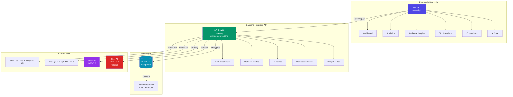
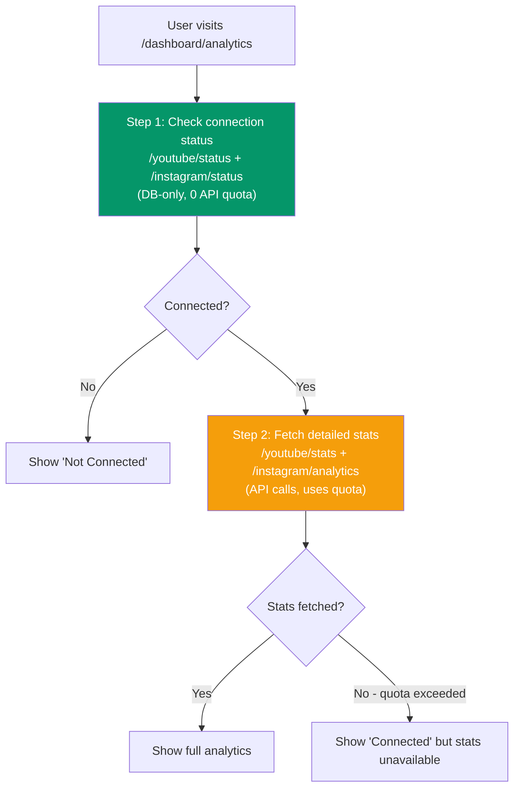
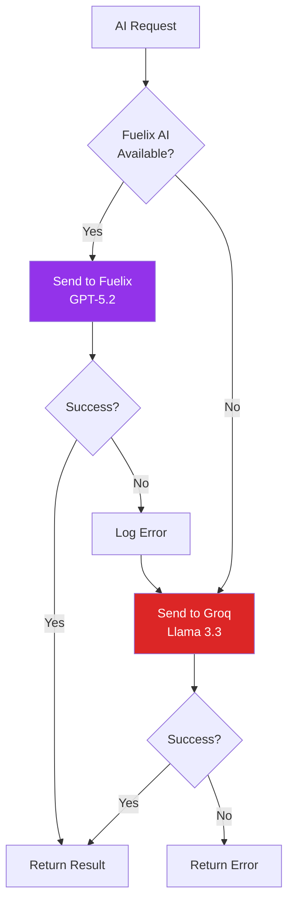
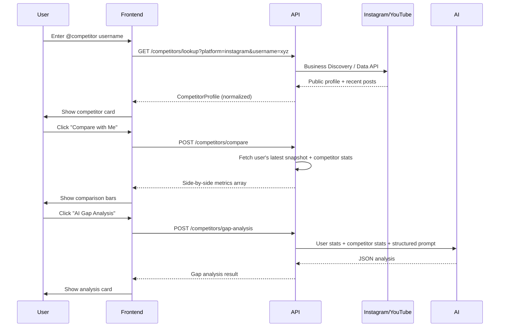
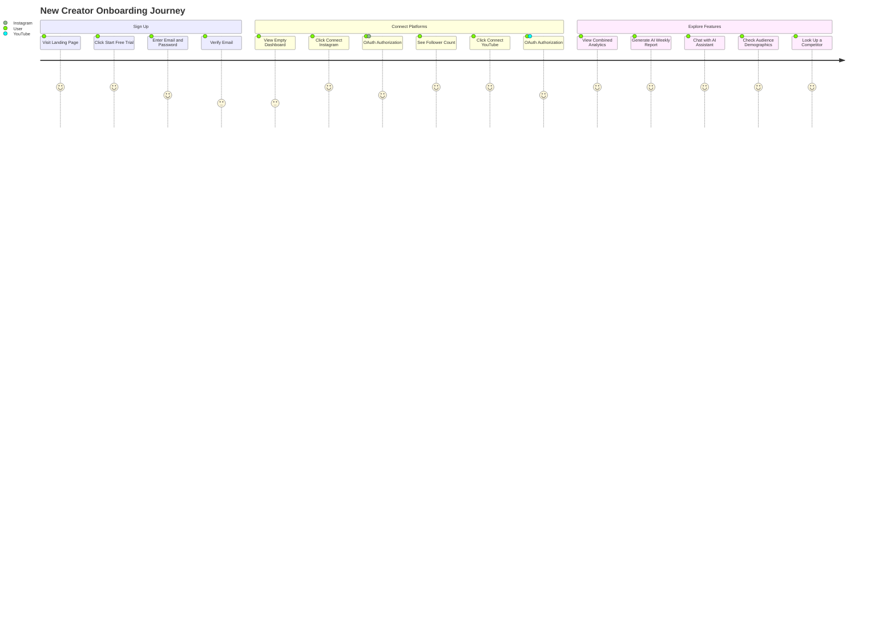
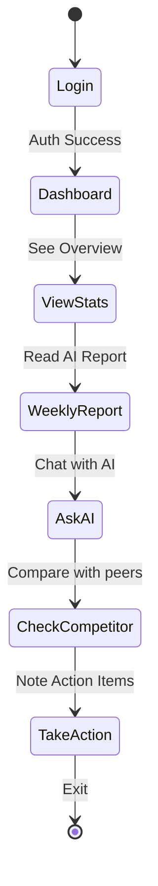

# CreatorIQ - Product Requirements Document

> **Version:** 3.0
> **Last Updated:** February 12, 2026
> **Status:** Production Ready — Platform Verification In Progress

---

## Table of Contents

1. [Overview](#overview)
2. [Product Vision](#product-vision)
3. [User Personas](#user-personas)
4. [Core Features](#core-features)
5. [Technical Architecture](#technical-architecture)
6. [Feature Specifications](#feature-specifications)
7. [User Flows](#user-flows)
8. [Success Metrics](#success-metrics)
9. [Security & Compliance](#security--compliance)
10. [Roadmap](#roadmap)

---

## Overview

**CreatorIQ** is an all-in-one analytics and management platform for Indian content creators, helping them:
- Track performance across YouTube, Instagram, and other platforms
- Get AI-powered insights and weekly growth reports
- Manage revenue and comply with Indian tax regulations
- Analyze audience demographics and optimize posting schedules
- Compare against competitors with AI gap analysis
- Chat with an AI assistant that knows their real analytics data

### Problem Statement

Content creators face three major challenges:
1. **Platform Fragmentation**: Switching between YouTube Studio, Instagram Insights, etc.
2. **Tax Complexity**: Understanding GST, TDS, and Indian tax rules for creator income
3. **Growth Uncertainty**: No clear guidance on what content works and why
4. **Competitor Blindspot**: No easy way to benchmark against similar creators

### Solution

CreatorIQ consolidates analytics, provides AI-driven insights, competitor intelligence, and simplifies tax management — all in one dashboard.

---

## Product Vision

**Mission**: Empower Indian creators to grow sustainably by making data-driven decisions.

**Vision**: Become the #1 creator operating system for Indian content creators by 2027.

### Success Criteria

| Metric | Target (Q2 2026) | Current Status |
|--------|------------------|----------------|
| Active Users | 10,000 | 1 (Beta) |
| Platform Connections | 15,000 | 2 (Instagram, YouTube) |
| AI Insights Generated | 50,000/month | Functional |
| Revenue Tracked | Rs 10 Cr+ | Feature Live |
| User Satisfaction | 4.5+/5 | TBD |

---

## User Personas

### Persona 1: Micro-Influencer Maya

| Attribute | Details |
|-----------|---------|
| **Age** | 24 |
| **Platforms** | Instagram (5K followers), YouTube (500 subs) |
| **Income** | Rs 15-20K/month from brand deals |
| **Pain Points** | Doesn't understand which content works, confused about GST, wastes time switching between apps |
| **Goals** | Reach 10K followers on Instagram, start monetizing YouTube, file taxes correctly |

### Persona 2: Tech YouTuber Rahul

| Attribute | Details |
|-----------|---------|
| **Age** | 28 |
| **Platforms** | YouTube (50K subs), Instagram (8K) |
| **Income** | Rs 80K-1L/month (AdSense + sponsorships) |
| **Pain Points** | Needs to optimize upload schedule, tracking multiple revenue streams manually, missing tax deductions |
| **Goals** | Grow to 100K subs, increase engagement rate, maximize tax savings |

---

## Core Features

### Feature Matrix

| Feature | Priority | Status | Target Users |
|---------|----------|--------|--------------|
| **Multi-Platform Analytics** | Critical | Live | All |
| **AI-Powered Insights** | Critical | Live | All |
| **AI Weekly Report** | Critical | Live | All |
| **AI Chat Assistant** | Critical | Live | All |
| **Audience Demographics** | High | Live | Maya, Rahul |
| **Best Posting Times** | High | Live | All |
| **Competitor Analysis** | High | Live | All |
| **Tax Calculator** | High | Live | Rahul |
| **Revenue Tracking** | High | Live | Rahul |
| **Brand Deal Manager** | Medium | Live | All |
| **Content Calendar** | Medium | Planned | All |

---

## Technical Architecture

### System Architecture Diagram



### Tech Stack

| Layer | Technology | Purpose |
|-------|-----------|---------|
| **Frontend** | Next.js 14, React, TypeScript, TailwindCSS | Modern, responsive UI with SSR |
| **Backend** | Express.js, TypeScript, Node.js | RESTful API server |
| **Database** | Supabase (PostgreSQL) | User data, analytics, platform connections |
| **Authentication** | Supabase Auth + JWT | Secure user sessions |
| **Platform APIs** | YouTube Data v3 + Analytics v2, Instagram Graph API v22.0 | Fetch creator metrics |
| **AI Services** | Fuelix AI (GPT-5.2 primary), Groq (Llama 3.3 fallback) | Generate insights, chat, reports |
| **Security** | AES-256-GCM encryption | Protect access tokens |
| **Deployment** | Render (Frontend + Backend), GoDaddy DNS | Cloud hosting |

---

## Feature Specifications

### 1. Multi-Platform Analytics

**Description**: Connect YouTube, Instagram, and view unified analytics in one dashboard.

#### User Story
> As a creator, I want to see all my analytics in one place so that I don't have to switch between platforms.

#### Acceptance Criteria
- User can connect Instagram Business account via OAuth
- User can connect YouTube channel via Google OAuth
- Dashboard shows combined follower/subscriber count
- Platform cards show connection status even when API quota is exceeded
- Real-time sync of analytics data

#### Analytics Page Architecture (v3.0)

The analytics page uses a two-step connection check pattern to avoid showing "Not Connected" when API quota is exceeded:



#### YouTube API Quota Optimization (v3.0)

YouTube API quota is 10,000 units/day shared across all users. Critical optimization:

| Operation | Before (v2.0) | After (v3.0) | Savings |
|-----------|---------------|--------------|---------|
| Get recent videos | `search.list` (100 units) | `playlistItems.list` (1 unit) | 99% |
| Get posting times | `search.list` (100 units) | `playlistItems.list` (1 unit) | 99% |
| Channel stats | `channels.list` (1 unit) | `channels.list` (1 unit) | 0% |
| **Total per user** | **201 units** | **3 units** | **98.5%** |

**How**: Derive uploads playlist ID from channel ID (`UC...` to `UU...` prefix swap).

---

### 2. AI-Powered Insights

**Description**: Generate personalized, data-driven recommendations using AI.

#### AI Services

| Feature | Endpoint | Description |
|---------|----------|-------------|
| **Insights** | `POST /ai/insights` | One-time analysis of creator's performance |
| **Weekly Report** | `POST /ai/analytics-report` | Structured JSON report with growth score |
| **AI Chat** | `POST /ai/chat` | Conversational AI with analytics context |
| **Content Ideas** | `POST /ai/content-ideas` | AI-generated content suggestions |
| **Tax Categorization** | `POST /ai/categorize-tax` | Smart revenue categorization |
| **Competitor Analysis** | `POST /competitors/gap-analysis` | AI-powered competitive gap analysis |

#### AI Architecture



#### Weekly Report (v3.0)

The `POST /ai/analytics-report` returns structured JSON consumed by the `WeeklyReport` component:

| Field | Description | UI Element |
|-------|-------------|------------|
| `growthScore` | 0-100 overall score | Circular progress indicator |
| `statInsights` | Per-metric analysis | Stat cards with trend arrows |
| `platformNudges` | Platform-specific tips | Highlighted tip cards |
| `whatsWorking` | Positive trends | Green checkmark list |
| `needsAttention` | Areas to improve | Orange warning list |
| `weeklyAction` | Top priority action | Bold action card |
| `goalText` | Goal + progress | Goal progress bar |

#### AI Chat (v3.0)

The AI chat system auto-injects the user's real analytics data into every message context. The system prompt ensures the AI:
- Never asks the user for their handle or data
- References specific numbers from the user's actual metrics
- Provides actionable, creator-specific advice

---

### 3. Competitor Analysis (v3.0)

**Description**: Look up any Instagram/YouTube competitor, compare side-by-side, and get AI-powered gap analysis.

#### User Story
> As a creator, I want to see how I compare to similar creators so I can identify what to improve.

#### How It Works



#### API Endpoints

| Method | Endpoint | Description |
|--------|----------|-------------|
| GET | `/competitors/lookup` | Look up competitor's public profile |
| POST | `/competitors/compare` | Side-by-side stat comparison |
| POST | `/competitors/gap-analysis` | AI-powered competitive analysis |
| GET | `/competitors/saved` | List saved competitors |
| POST | `/competitors/saved` | Save a competitor |
| DELETE | `/competitors/saved/:id` | Remove saved competitor |

#### Gap Analysis Output

```json
{
  "overallVerdict": "Competitor has 5x your followers but your engagement is 3x higher",
  "competitiveScore": 62,
  "metrics": [
    { "metric": "Followers", "you": 212, "competitor": 1050, "difference": "-80%", "verdict": "behind" }
  ],
  "strengths": ["3x higher engagement rate"],
  "gaps": ["Competitor posts 5x/week vs your 2x/week"],
  "actionPlan": [
    { "action": "Increase to 4 posts/week", "expectedImpact": "2x reach", "priority": "high", "timeframe": "2 weeks" }
  ],
  "contentStrategy": "Mirror competitor's Reel-heavy approach but leverage your superior engagement..."
}
```

---

### 4. Audience Demographics

**Description**: Show creator's audience breakdown by location, age, and gender.

#### Platform Support

| Platform | Demographics Available | Requirements |
|----------|------------------------|--------------|
| **Instagram** | Cities, Countries, Age/Gender | Business/Creator account, 100+ followers |
| **YouTube** | Geography, Age/Gender (with YPP) | YouTube Partner Program for age/gender |

#### Instagram Demographics API (v22.0)

Three separate API calls required with `metric_type: 'total_value'`:

| Call | Breakdown | Returns |
|------|-----------|---------|
| 1 | `country` | Country distribution |
| 2 | `city` | City distribution |
| 3 | `age,gender` | Age/gender breakdown |

---

### 5. Tax Calculator

**Description**: Calculate GST, TDS, and income tax for creator revenue.

#### Supported Income Types

| Income Source | GST Rate | TDS Rate | Deductible |
|---------------|----------|----------|------------|
| **Brand Deals** | 18% | 10% (>Rs 10L) | Yes |
| **YouTube AdSense** | 18% | 0% (foreign income) | Yes |
| **Sponsorships** | 18% | 10% | Yes |
| **Affiliate Commissions** | 18% | 10% | Yes |
| **Digital Products** | 18% | 0% | Yes |

---

### 6. Dynamic Sidebar (v3.0)

The sidebar fetches live user data and platform connection status:

| Element | Source | Fallback |
|---------|--------|----------|
| User name | `user_metadata.full_name` | Email prefix |
| User email | `user.email` | Empty |
| Initials avatar | First letters of name | "CR" |
| YouTube status | `GET /youtube/status` (DB-only) | Gray dot |
| Instagram status | `GET /instagram/status` (DB-only) | Gray dot |

---

### 7. Analytics Snapshot Job (v3.0)

Background job that captures daily metrics for all connected platforms:

| Feature | Implementation |
|---------|---------------|
| **Schedule** | Runs on server startup + daily at 2:00 AM |
| **12-hour skip** | Skips platforms synced < 12h ago to save quota |
| **Channel ID reuse** | Reuses channelId from first call to avoid redundant API calls |
| **Token decryption** | All tokens decrypted via `encryptionService.safeDecrypt()` |
| **Token refresh** | YouTube tokens refreshed before use, new token encrypted and stored |

---

## User Flows

### Flow 1: New User Onboarding



### Flow 2: Daily Analytics Check



---

## Success Metrics

### KPIs

#### Product Metrics

| Metric | Definition | Target | How to Measure |
|--------|------------|--------|----------------|
| **DAU** | Daily Active Users | 1,000 by Q3 | Users who log in daily |
| **Platform Connections** | Avg platforms per user | 2.5 | Count of connected accounts |
| **AI Usage** | % users using AI features weekly | 60% | Weekly insights + chat + report usage |
| **Retention Rate** | Week-over-week retention | 40% | Users active in week N+1 |
| **Competitor Lookups** | Avg competitor analyses per user/month | 5 | API call count |

#### Business Metrics

| Metric | Definition | Target | How to Measure |
|--------|------------|--------|----------------|
| **MRR** | Monthly Recurring Revenue | Rs 5L by Q4 | Sum of active subscriptions |
| **ARPU** | Average Revenue Per User | Rs 99/month | MRR / Active Users |
| **Churn Rate** | Monthly user churn | <5% | Canceled subscriptions |
| **NPS** | Net Promoter Score | 50+ | User survey |

---

## Security & Compliance

### Data Protection

| Aspect | Implementation |
|--------|----------------|
| **Token Encryption** | AES-256-GCM with environment-based keys |
| **Token Decryption** | `safeDecrypt()` with plaintext fallback for legacy tokens |
| **Authentication** | Supabase Auth + JWT |
| **OAuth Security** | State parameter validation, HTTPS-only redirects |
| **Data Storage** | Encrypted at rest (Supabase), HTTPS in transit |
| **Privacy Policy** | Meta App Review compliant (creatoriq.in/privacy) |

### Compliance

| Requirement | Status |
|------------|--------|
| **DPDPA** (Indian Data Protection) | Compliant |
| **Meta Platform Terms** | Compliant (privacy policy updated) |
| **Google API Services User Data Policy** | Compliant |
| **Age Restriction** | 13+ enforced |
| **Data Deletion** | Platform data deleted within 24h of disconnect |

### Platform Verification Status

| Platform | Branding | Data Access | App Review |
|----------|----------|-------------|------------|
| **Google OAuth** | Verified & Published | Pending (needs demo video + scope justifications) | N/A |
| **Facebook/Instagram** | N/A | N/A | Not Started (App ID: 765342356611450) |

---

## Roadmap

### Q1 2026 (Completed)
- [x] Multi-platform analytics (Instagram, YouTube)
- [x] AI-powered insights with Fuelix GPT-5.2
- [x] Audience demographics
- [x] Tax calculator
- [x] Revenue tracking
- [x] Brand deal manager
- [x] AI weekly report (structured JSON)
- [x] AI chat assistant with analytics context
- [x] Competitor analysis (lookup, compare, AI gap analysis, saved competitors)
- [x] YouTube API quota optimization (98.5% reduction)
- [x] Token encryption bug fix
- [x] Analytics snapshot job with 12h skip + channel ID reuse
- [x] Dynamic sidebar with real user data
- [x] Privacy policy Meta compliance
- [x] Analytics page two-step connection check

### Q2 2026 (In Progress)
- [ ] Google OAuth data access verification
- [ ] Facebook/Instagram app review submission
- [ ] Mobile app (React Native)
- [ ] LinkedIn analytics integration
- [ ] Content calendar with AI suggestions

### Q3 2026 (Planned)
- [ ] X (Twitter) analytics integration
- [ ] Automated PDF reporting
- [ ] Chrome extension
- [ ] Integration marketplace (Zapier, Make)
- [ ] White-label solution for agencies

---

## Deployment

| Service | URL | Method |
|---------|-----|--------|
| **API (Express)** | https://creatoriq-axxp.onrender.com | Auto-deploy via render.yaml |
| **Frontend (Next.js)** | https://creatoriq-web.onrender.com | Manual deploy |
| **Domain** | https://creatoriq.in | GoDaddy DNS to Render |
| **Alt Domain** | https://indiva.co.in | GoDaddy DNS to Render |

---

## Support & Feedback

| Channel | Purpose | Contact |
|---------|---------|---------|
| **Email (General)** | Support requests | support@creatoriq.in |
| **Email (Privacy)** | Data rights, deletion | privacy@creatoriq.in |
| **GitHub Issues** | Bug reports, features | github.com/ritwikvats/creatoriq |
| **Website** | Landing page | creatoriq.in |

---

## Changelog

### v3.0 (February 12, 2026)
- YouTube API quota optimization (search.list to playlistItems.list, 98.5% reduction)
- Competitor analysis (full stack: backend services + frontend page + search, comparison, gap analysis components)
- AI weekly report with structured JSON and WeeklyReport component
- AI chat assistant with auto-injected analytics context
- Analytics page two-step connection check (status-first pattern)
- Token encryption bug fix (safeDecrypt in snapshot job + stats routes)
- Snapshot job optimization (12h skip logic + channelId reuse)
- Dynamic sidebar with real user data from Supabase Auth
- Privacy policy updated for Meta App Review compliance
- Updated deployment URLs to actual Render services

### v2.0 (February 8, 2026)
- Initial PRD with full feature specs
- Core architecture diagrams (Mermaid)
- User personas, flows, success metrics

---

**Document Owner**: Product Team
**Contributors**: Engineering, Design, Marketing
**Review Cycle**: Monthly
