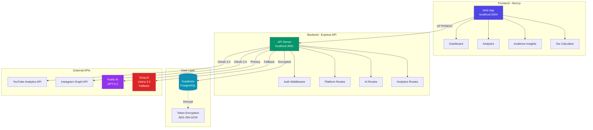
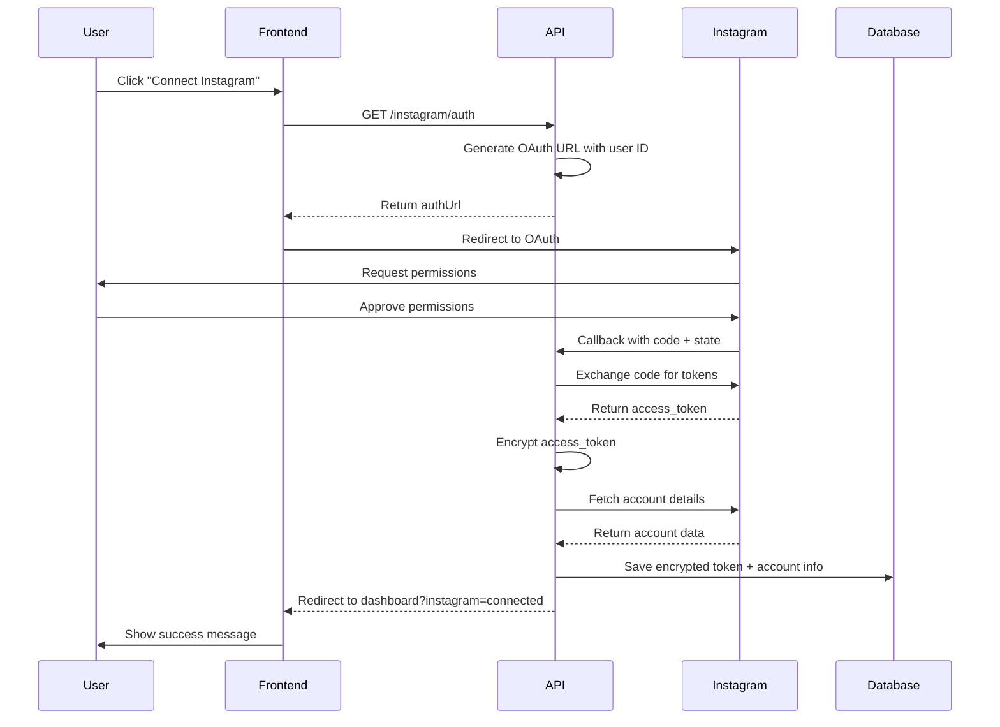
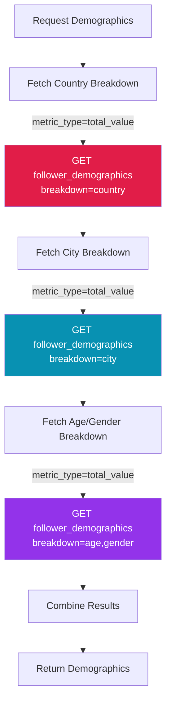
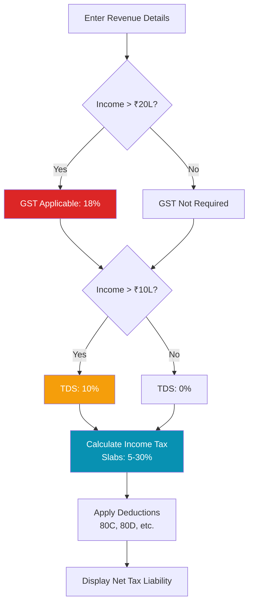
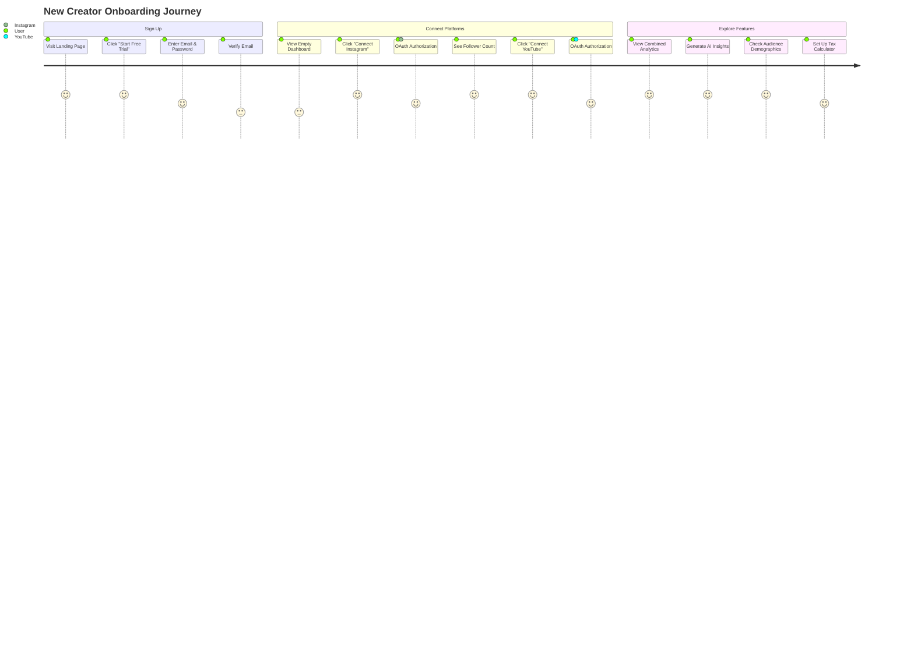
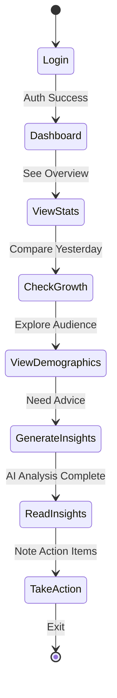

# CreatorIQ - Product Requirements Document

> **Version:** 2.0
> **Last Updated:** February 8, 2026
> **Status:** ✅ Production Ready

---

## 📋 Table of Contents

1. [Overview](#overview)
2. [Product Vision](#product-vision)
3. [User Personas](#user-personas)
4. [Core Features](#core-features)
5. [Technical Architecture](#technical-architecture)
6. [Feature Specifications](#feature-specifications)
7. [User Flows](#user-flows)
8. [Success Metrics](#success-metrics)

---

## 🎯 Overview

**CreatorIQ** is an all-in-one analytics and management platform for Indian content creators, helping them:
- Track performance across YouTube, Instagram, and other platforms
- Get AI-powered insights for growth optimization
- Manage revenue and comply with Indian tax regulations
- Analyze audience demographics and optimize posting schedules

### Problem Statement

Content creators face three major challenges:
1. **Platform Fragmentation**: Switching between YouTube Studio, Instagram Insights, etc.
2. **Tax Complexity**: Understanding GST, TDS, and Indian tax rules for creator income
3. **Growth Uncertainty**: No clear guidance on what content works and why

### Solution

CreatorIQ consolidates analytics, provides AI-driven insights, and simplifies tax management—all in one dashboard.

---

## 🚀 Product Vision

**Mission**: Empower Indian creators to grow sustainably by making data-driven decisions.

**Vision**: Become the #1 creator operating system for Indian content creators by 2027.

### Success Criteria

| Metric | Target (Q2 2026) | Current Status |
|--------|------------------|----------------|
| Active Users | 10,000 | 1 (Beta) |
| Platform Connections | 15,000 | 2 (Instagram, YouTube) |
| AI Insights Generated | 50,000/month | ✅ Functional |
| Revenue Tracked | ₹10 Cr+ | ✅ Feature Live |
| User Satisfaction | 4.5+/5 | TBD |

---

## 👥 User Personas

### Persona 1: Micro-Influencer Maya

| Attribute | Details |
|-----------|---------|
| **Age** | 24 |
| **Platforms** | Instagram (5K followers), YouTube (500 subs) |
| **Income** | ₹15-20K/month from brand deals |
| **Pain Points** | • Doesn't understand which content works<br>• Confused about GST registration<br>• Wastes time switching between apps |
| **Goals** | • Reach 10K followers on Instagram<br>• Start monetizing YouTube<br>• File taxes correctly |

### Persona 2: Tech YouTuber Rahul

| Attribute | Details |
|-----------|---------|
| **Age** | 28 |
| **Platforms** | YouTube (50K subs), Instagram (8K) |
| **Income** | ₹80K-1L/month (AdSense + sponsorships) |
| **Pain Points** | • Needs to optimize upload schedule<br>• Tracking multiple revenue streams manually<br>• Missing tax deductions |
| **Goals** | • Grow to 100K subs<br>• Increase engagement rate<br>• Maximize tax savings |

---

## ✨ Core Features

### Feature Matrix

| Feature | Priority | Status | Target Users |
|---------|----------|--------|--------------|
| **Multi-Platform Analytics** | 🔴 Critical | ✅ Live | All |
| **AI-Powered Insights** | 🔴 Critical | ✅ Live | All |
| **Audience Demographics** | 🟡 High | ✅ Live | Maya, Rahul |
| **Best Posting Times** | 🟡 High | ✅ Live | All |
| **Tax Calculator** | 🟡 High | ✅ Live | Rahul |
| **Revenue Tracking** | 🟡 High | ✅ Live | Rahul |
| **Brand Deal Manager** | 🟢 Medium | ✅ Live | All |
| **Content Calendar** | 🟢 Medium | 📋 Planned | All |
| **Competitor Analysis** | ⚪ Low | 📋 Future | Rahul |

**Legend**: 🔴 Critical | 🟡 High | 🟢 Medium | ⚪ Low

---

## 🏗️ Technical Architecture

### System Architecture Diagram



### Tech Stack

| Layer | Technology | Purpose |
|-------|-----------|---------|
| **Frontend** | Next.js 14, React, TypeScript, TailwindCSS | Modern, responsive UI with SSR |
| **Backend** | Express.js, TypeScript, Node.js | RESTful API server |
| **Database** | Supabase (PostgreSQL) | User data, analytics, platform connections |
| **Authentication** | Supabase Auth + JWT | Secure user sessions |
| **Platform APIs** | YouTube Analytics v3, Instagram Graph API v22.0 | Fetch creator metrics |
| **AI Services** | Fuelix AI (GPT-5.2), Groq (Llama 3.3) | Generate insights and recommendations |
| **Security** | AES-256-GCM encryption | Protect access tokens |
| **Deployment** | Vercel (Frontend), Railway/Render (Backend) | Cloud hosting |

---

## 📐 Feature Specifications

### 1. Multi-Platform Analytics

**Description**: Connect YouTube, Instagram, and view unified analytics in one dashboard.

#### User Story
> As a creator, I want to see all my analytics in one place so that I don't have to switch between platforms.

#### Acceptance Criteria
- ✅ User can connect Instagram Business account via OAuth
- ✅ User can connect YouTube channel via Google OAuth
- ✅ Dashboard shows combined follower/subscriber count
- ✅ Real-time sync of analytics data
- ✅ Platform cards show last updated timestamp

#### Technical Implementation

**Instagram Connection Flow:**



**Data Model:**

| Field | Type | Description |
|-------|------|-------------|
| `user_id` | UUID | Foreign key to users table |
| `platform` | ENUM | 'instagram', 'youtube', etc. |
| `platform_user_id` | VARCHAR | Instagram account ID or YouTube channel ID |
| `platform_username` | VARCHAR | Display name (@username) |
| `access_token` | TEXT | Encrypted OAuth token |
| `refresh_token` | TEXT | Encrypted refresh token (YouTube only) |
| `token_expires_at` | TIMESTAMP | Token expiry (YouTube only) |
| `connected_at` | TIMESTAMP | When the platform was first connected |
| `updated_at` | TIMESTAMP | Last data sync |

---

### 2. AI-Powered Insights

**Description**: Generate personalized, data-driven recommendations using AI (Fuelix GPT-5.2).

#### User Story
> As a creator, I want AI to analyze my performance and tell me what to improve so that I can grow faster.

#### Acceptance Criteria
- ✅ Insights use real platform data (not generic advice)
- ✅ Output includes specific metrics from user's account
- ✅ Recommendations are actionable with clear next steps
- ✅ Beautiful formatting with emojis and sections
- ✅ Compares user metrics to industry benchmarks

#### AI Insights Architecture

```mermaid
graph LR
    A[User Clicks<br/>"Generate Insights"] --> B[Fetch Instagram<br/>Analytics]
    B --> C[Fetch YouTube<br/>Analytics]
    C --> D[Combine Data]
    D --> E{Fuelix AI<br/>Available?}
    E -->|Yes| F[Send to Fuelix<br/>GPT-5.2]
    E -->|No| G[Send to Groq<br/>Llama 3.3]
    F --> H[Format Response]
    G --> H
    H --> I[Display Beautiful<br/>Insights]

    style F fill:#9333EA,color:#fff
    style G fill:#DC2626,color:#fff
```

#### Sample Output Format

```markdown
## 📈 Performance Overview
Your Instagram account (@ssup.ritwik) has 209 followers with an engagement
rate of 4.2%, which is **15% above** the industry average of 3.5%.

## 🎯 Key Strengths (What's Working)
- **High engagement**: Your 12 avg likes + 3 comments per post shows strong connection
- **Consistent posting**: 39 posts indicate regular content creation

## ⚠️ Growth Opportunities
- **Increase posting frequency**: Currently averaging 2 posts/week. Aim for 3-4/week
  to boost reach by an estimated 30%
- **Optimize hashtags**: Your top posts use 8-12 hashtags. Test 15-20 for better discovery

## 💡 Top 3 Action Items
1. **Post on Thursdays at 18:00**: Your data shows highest engagement at this time
2. **Repurpose your best content**: Your top post (45 likes) can be turned into a Reel
3. **Engage with followers**: Reply to all comments within 1 hour to boost algorithm

## 🚀 30-Day Goal
Reach **250 followers** (20% growth) by posting 12 high-quality posts and engaging daily
```

---

### 3. Audience Demographics

**Description**: Show creator's audience breakdown by location, age, and gender.

#### Platform Support

| Platform | Demographics Available | Requirements |
|----------|------------------------|--------------|
| **Instagram** | ✅ Cities, Countries, Age/Gender | • Business/Creator account<br/>• Linked to Facebook Page<br/>• 100+ followers |
| **YouTube** | ✅ Geography, Age/Gender (with YPP) | • YouTube Partner Program<br/>• Analytics API access |

#### Instagram Demographics API

**Endpoint**: `/instagram/demographics`

**API Call Breakdown:**



**Response Format:**

```typescript
{
  cities: [
    { city: "Bangalore, India", count: 45 },
    { city: "Mumbai, India", count: 32 },
    { city: "Delhi, India", count: 28 }
  ],
  countries: [
    { country: "IN", count: 180 },
    { country: "US", count: 15 },
    { country: "GB", count: 8 }
  ],
  ageGender: [
    { ageRange: "25-34", gender: "Male", count: 42 },
    { ageRange: "18-24", gender: "Female", count: 38 },
    { ageRange: "25-34", gender: "Female", count: 35 }
  ]
}
```

---

### 4. Tax Calculator

**Description**: Calculate GST, TDS, and income tax for creator revenue with automatic rule updates.

#### Supported Income Types

| Income Source | GST Rate | TDS Rate | Deductible |
|---------------|----------|----------|------------|
| **Brand Deals** | 18% | 10% (>₹10L) | ✅ |
| **YouTube AdSense** | 18% | 0% (foreign income) | ✅ |
| **Sponsorships** | 18% | 10% | ✅ |
| **Affiliate Commissions** | 18% | 10% | ✅ |
| **Digital Products** | 18% | 0% | ✅ |
| **Consulting/Coaching** | 18% | 10% | ✅ |

#### Tax Calculation Flow



---

## 🔄 User Flows

### Flow 1: New User Onboarding



### Flow 2: Daily Analytics Check



---

## 📊 Success Metrics

### KPIs (Key Performance Indicators)

#### Product Metrics

| Metric | Definition | Target | How to Measure |
|--------|------------|--------|----------------|
| **DAU** | Daily Active Users | 1,000 by Q3 | Users who log in daily |
| **Platform Connections** | Avg platforms per user | 2.5 | Count of connected accounts |
| **AI Insights Usage** | % users generating insights weekly | 60% | Weekly insights generation rate |
| **Retention Rate** | Week-over-week retention | 40% | Users active in week N+1 |
| **Feature Adoption** | % users using 3+ features | 70% | Feature usage tracking |

#### Business Metrics

| Metric | Definition | Target | How to Measure |
|--------|------------|--------|----------------|
| **MRR** | Monthly Recurring Revenue | ₹5L by Q4 | Sum of active subscriptions |
| **ARPU** | Average Revenue Per User | ₹99/month | MRR / Active Users |
| **Churn Rate** | Monthly user churn | <5% | Canceled subscriptions |
| **NPS** | Net Promoter Score | 50+ | User survey |
| **CAC** | Customer Acquisition Cost | <₹200 | Marketing spend / New users |

---

## 🔐 Security & Compliance

### Data Protection

| Aspect | Implementation |
|--------|----------------|
| **Token Encryption** | AES-256-GCM with environment-based encryption keys |
| **Authentication** | JWT tokens with 7-day expiry + refresh tokens |
| **OAuth Security** | State parameter validation, HTTPS-only redirects |
| **Data Storage** | Encrypted at rest (Supabase), HTTPS in transit |
| **PII Handling** | Minimal collection, GDPR/DPDPA compliant |

### Compliance

- ✅ **DPDPA (Digital Personal Data Protection Act)** - Indian data protection law
- ✅ **Platform Terms** - YouTube ToS, Instagram Platform Policy
- ✅ **Tax Regulations** - Accurate GST/TDS calculations per CBDT guidelines

---

## 📅 Roadmap

### Q1 2026 (Completed ✅)
- [x] Multi-platform analytics (Instagram, YouTube)
- [x] AI-powered insights with Fuelix GPT-5.2
- [x] Audience demographics
- [x] Tax calculator
- [x] Revenue tracking
- [x] Brand deal manager

### Q2 2026 (In Progress 🚧)
- [ ] Mobile app (React Native)
- [ ] LinkedIn analytics integration
- [ ] X (Twitter) analytics integration
- [ ] Content calendar with AI suggestions
- [ ] Team collaboration features

### Q3 2026 (Planned 📋)
- [ ] Competitor analysis
- [ ] Automated reporting (PDF exports)
- [ ] Chrome extension for quick analytics
- [ ] Integration marketplace (Zapier, Make)
- [ ] White-label solution for agencies

---

## 📞 Support & Feedback

| Channel | Purpose | Response Time |
|---------|---------|---------------|
| **Email** | support@creatoriq.app | 24 hours |
| **Discord** | Community support | Real-time |
| **GitHub Issues** | Bug reports, feature requests | 48 hours |
| **Twitter** | Product updates | N/A |

---

**Document Owner**: Product Team
**Contributors**: Engineering, Design, Marketing
**Review Cycle**: Monthly
