# CreatorIQ - Technical Documentation

> **Version:** 3.0
> **Last Updated:** February 12, 2026
> **Target Audience:** Developers, DevOps Engineers, Technical Contributors

---

## Table of Contents

1. [System Architecture](#system-architecture)
2. [Technology Stack](#technology-stack)
3. [API Documentation](#api-documentation)
4. [Database Schema](#database-schema)
5. [Authentication Flow](#authentication-flow)
6. [Platform Integrations](#platform-integrations)
7. [Competitor Analysis](#competitor-analysis)
8. [AI Services Integration](#ai-services-integration)
9. [Security Implementation](#security-implementation)
10. [Analytics Snapshot Job](#analytics-snapshot-job)
11. [Frontend Architecture](#frontend-architecture)
12. [Privacy & Compliance](#privacy--compliance)
13. [Deployment Guide](#deployment-guide)
14. [Development Workflow](#development-workflow)
15. [Troubleshooting](#troubleshooting)
16. [Changelog](#changelog)

---

## System Architecture

### High-Level Architecture

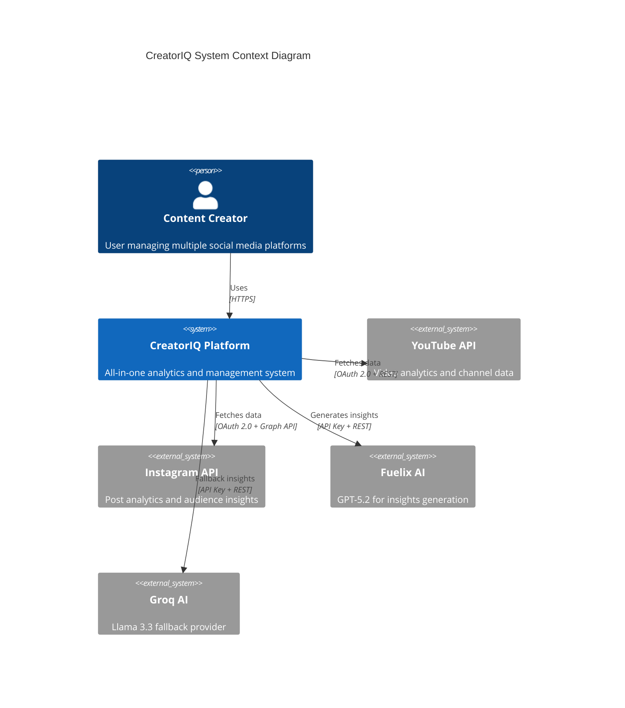

### Application Architecture

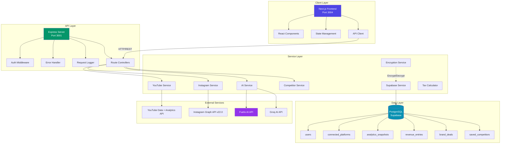

---

## Technology Stack

### Frontend Stack

| Technology | Version | Purpose |
|------------|---------|---------|
| **Next.js** | 14.2.x | React framework with SSR/SSG |
| **React** | 18.x | UI library |
| **TypeScript** | 5.x | Type-safe JavaScript |
| **TailwindCSS** | 3.x | Utility-first CSS framework |
| **Lucide Icons** | Latest | Modern icon library |
| **Recharts** | 2.x | Data visualization |
| **ReactMarkdown** | Latest | AI chat response rendering |

### Backend Stack

| Technology | Version | Purpose |
|------------|---------|---------|
| **Node.js** | 20.x LTS | JavaScript runtime |
| **Express** | 4.x | Web server framework |
| **TypeScript** | 5.x | Type-safe backend code |
| **Axios** | 1.x | HTTP client for external APIs |
| **Groq SDK** | Latest | Groq AI integration |
| **Googleapis** | Latest | YouTube API client |

### Database & Storage

| Technology | Purpose |
|------------|---------|
| **Supabase** | PostgreSQL database + Auth |
| **PostgreSQL** | 15.x - Relational database |
| **Row-Level Security** | Data access control |

### AI & ML

| Service | Model | Purpose |
|---------|-------|---------|
| **Fuelix AI** | GPT-5.2 Chat | Primary AI for insights, chat, reports |
| **Groq** | Llama 3.3 70B | Fallback AI provider |

---

## API Documentation

### Base URLs

| Environment | URL |
|-------------|-----|
| **Development** | http://localhost:3001 |
| **Production** | https://creatoriq-axxp.onrender.com |

### Authentication

All protected endpoints require a JWT token in the Authorization header:

```http
Authorization: Bearer <jwt_token>
```

### API Endpoints Reference

#### Authentication Endpoints

| Method | Endpoint | Description | Auth |
|--------|----------|-------------|------|
| POST | `/auth/register` | Create new user account | No |
| POST | `/auth/login` | Login and get JWT token | No |
| POST | `/auth/logout` | Logout (invalidate token) | Yes |
| GET | `/auth/me` | Get current user info | Yes |

#### Platform Connection Endpoints

| Method | Endpoint | Description | Auth |
|--------|----------|-------------|------|
| GET | `/instagram/auth` | Get Instagram OAuth URL | Yes |
| GET | `/instagram/callback` | OAuth callback handler | No |
| GET | `/instagram/status` | Check connection status (DB-only) | Yes |
| GET | `/instagram/analytics` | Get Instagram analytics | Yes |
| GET | `/instagram/demographics` | Get audience demographics | Yes |
| POST | `/instagram/disconnect` | Disconnect Instagram | Yes |
| GET | `/youtube/auth` | Get YouTube OAuth URL | Yes |
| GET | `/youtube/callback` | OAuth callback handler | No |
| GET | `/youtube/status` | Check connection status (DB-only) | Yes |
| GET | `/youtube/stats` | Get YouTube stats (API calls) | Yes |
| GET | `/youtube/analytics` | Get YouTube analytics | Yes |
| POST | `/youtube/disconnect` | Disconnect YouTube | Yes |

#### Analytics Endpoints

| Method | Endpoint | Description | Auth |
|--------|----------|-------------|------|
| GET | `/analytics/timeline/:userId` | Get analytics timeline | Yes |
| GET | `/audience/demographics` | Get audience demographics | Yes |
| GET | `/audience/posting-times` | Get best posting times | Yes |

#### AI Endpoints

| Method | Endpoint | Description | Auth |
|--------|----------|-------------|------|
| POST | `/ai/insights` | Generate AI insights | Yes |
| POST | `/ai/analytics-report` | Generate structured weekly report | Yes |
| POST | `/ai/chat` | AI chat with analytics context | Yes |
| POST | `/ai/content-ideas` | Generate content ideas | Yes |
| POST | `/ai/categorize-tax` | Categorize revenue for tax | Yes |
| GET | `/ai/status` | Check AI service status | No |

#### Competitor Endpoints (v3.0)

| Method | Endpoint | Description | Auth |
|--------|----------|-------------|------|
| GET | `/competitors/lookup` | Look up competitor's public profile | Yes |
| POST | `/competitors/compare` | Side-by-side stat comparison | Yes |
| POST | `/competitors/gap-analysis` | AI-powered competitive analysis | Yes |
| GET | `/competitors/saved` | List saved competitors | Yes |
| POST | `/competitors/saved` | Save a competitor | Yes |
| DELETE | `/competitors/saved/:id` | Remove saved competitor | Yes |

---

### API Request/Response Examples

#### POST /ai/analytics-report (v3.0)

**Response (structured JSON):**
```json
{
  "success": true,
  "report": {
    "growthScore": 72,
    "statInsights": [
      { "label": "Followers", "value": "209", "trend": "up", "note": "+12 this week" }
    ],
    "platformNudges": ["Post 2 more Reels this week to boost reach"],
    "whatsWorking": ["Engagement rate 15% above average"],
    "needsAttention": ["Posting frequency dropped 30%"],
    "weeklyAction": "Create 3 Reels using trending audio",
    "goalText": "On track to reach 250 followers by March"
  },
  "model": "gpt-5.2-chat (Fuelix)"
}
```

#### GET /competitors/lookup?platform=instagram&username=natgeo

**Response:**
```json
{
  "success": true,
  "profile": {
    "platform": "instagram",
    "username": "natgeo",
    "displayName": "National Geographic",
    "profilePicture": "https://...",
    "bio": "Experience the world...",
    "followers": 283000000,
    "following": 150,
    "postsCount": 28500,
    "engagementRate": 0.45,
    "avgLikes": 850000,
    "avgComments": 3200,
    "postsPerWeek": 12.5,
    "recentPosts": [...]
  }
}
```

#### POST /competitors/gap-analysis

**Request:**
```json
{
  "platform": "instagram",
  "competitorUsername": "creator123"
}
```

**Response:**
```json
{
  "success": true,
  "analysis": {
    "overallVerdict": "Competitor has 5x your followers but your engagement is 3x higher",
    "competitiveScore": 62,
    "strengths": ["3x higher engagement rate at 24.76% vs 8.2%"],
    "gaps": ["Competitor posts 5x/week vs your 2x/week"],
    "actionPlan": [
      { "action": "Increase to 4 posts/week", "expectedImpact": "2x reach", "priority": "high", "timeframe": "2 weeks" }
    ],
    "contentStrategy": "Mirror competitor's Reel-heavy approach but leverage your superior engagement..."
  }
}
```

---

## Database Schema

### Entity Relationship Diagram

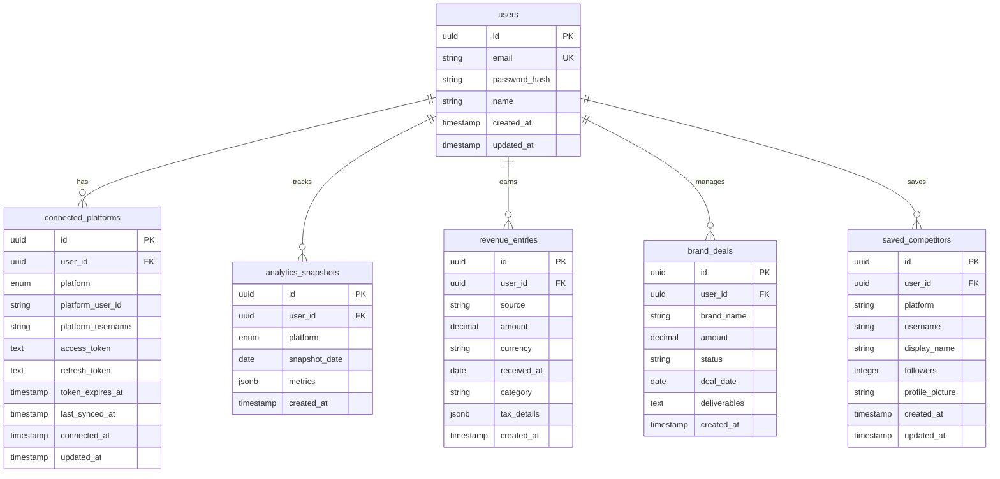

### Key Tables

#### `connected_platforms` Table

| Column | Type | Constraints | Description |
|--------|------|-------------|-------------|
| `id` | UUID | PRIMARY KEY | Unique connection ID |
| `user_id` | UUID | FOREIGN KEY | Reference to users table |
| `platform` | ENUM | NOT NULL | 'instagram', 'youtube' |
| `platform_user_id` | VARCHAR(255) | NOT NULL | Instagram account ID or YouTube channel ID |
| `platform_username` | VARCHAR(100) | | Display name (@username) |
| `access_token` | TEXT | ENCRYPTED | OAuth access token (AES-256-GCM) |
| `refresh_token` | TEXT | ENCRYPTED | OAuth refresh token (AES-256-GCM, v3.0) |
| `token_expires_at` | TIMESTAMP | | Token expiry (YouTube only) |
| `last_synced_at` | TIMESTAMP | | Last snapshot sync time (v3.0) |
| `connected_at` | TIMESTAMP | DEFAULT NOW() | When platform was first connected |
| `updated_at` | TIMESTAMP | DEFAULT NOW() | Last token refresh/update |

**Indexes:**
- `UNIQUE(user_id, platform)` - One connection per platform per user
- `INDEX(user_id)` - Fast user lookups

#### `saved_competitors` Table (v3.0)

| Column | Type | Constraints | Description |
|--------|------|-------------|-------------|
| `id` | UUID | PRIMARY KEY | Unique ID |
| `user_id` | UUID | FOREIGN KEY | Reference to users table |
| `platform` | VARCHAR | NOT NULL | 'instagram' or 'youtube' |
| `username` | VARCHAR | NOT NULL | Competitor's username |
| `display_name` | VARCHAR | | Competitor's display name |
| `followers` | INTEGER | DEFAULT 0 | Last known follower count |
| `profile_picture` | TEXT | | Profile picture URL |
| `created_at` | TIMESTAMP | DEFAULT NOW() | When competitor was saved |
| `updated_at` | TIMESTAMP | DEFAULT NOW() | Last updated |

**Indexes:**
- `UNIQUE(user_id, platform, username)` - One save per competitor per user

---

## Authentication Flow

### JWT Token Authentication

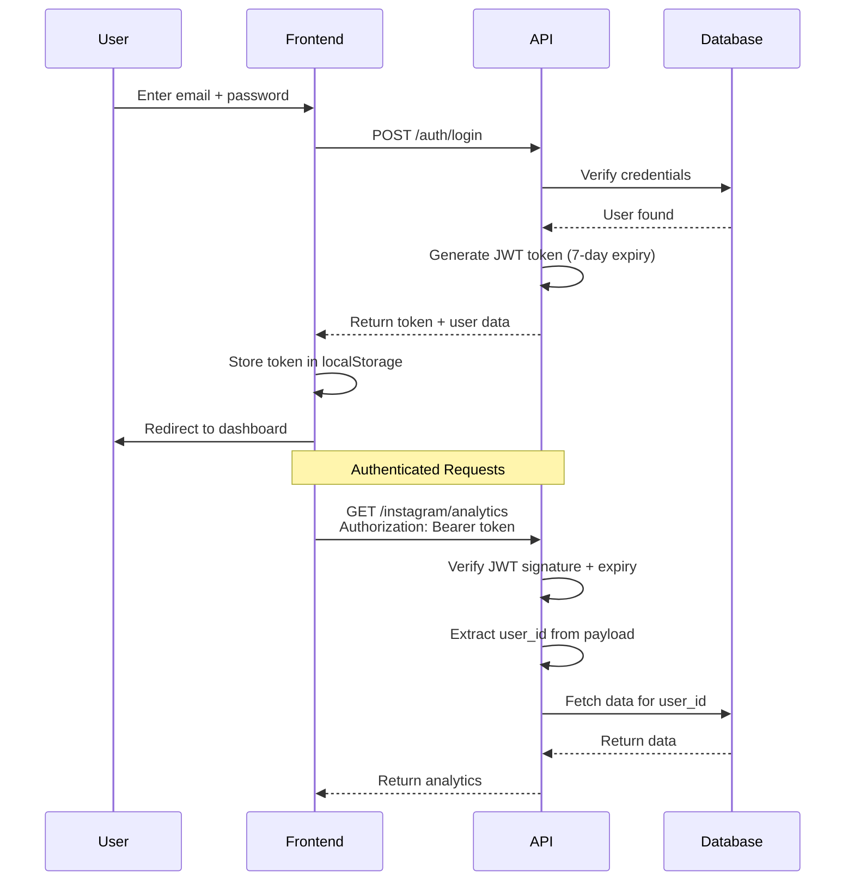

### OAuth 2.0 Flow (Instagram Example)

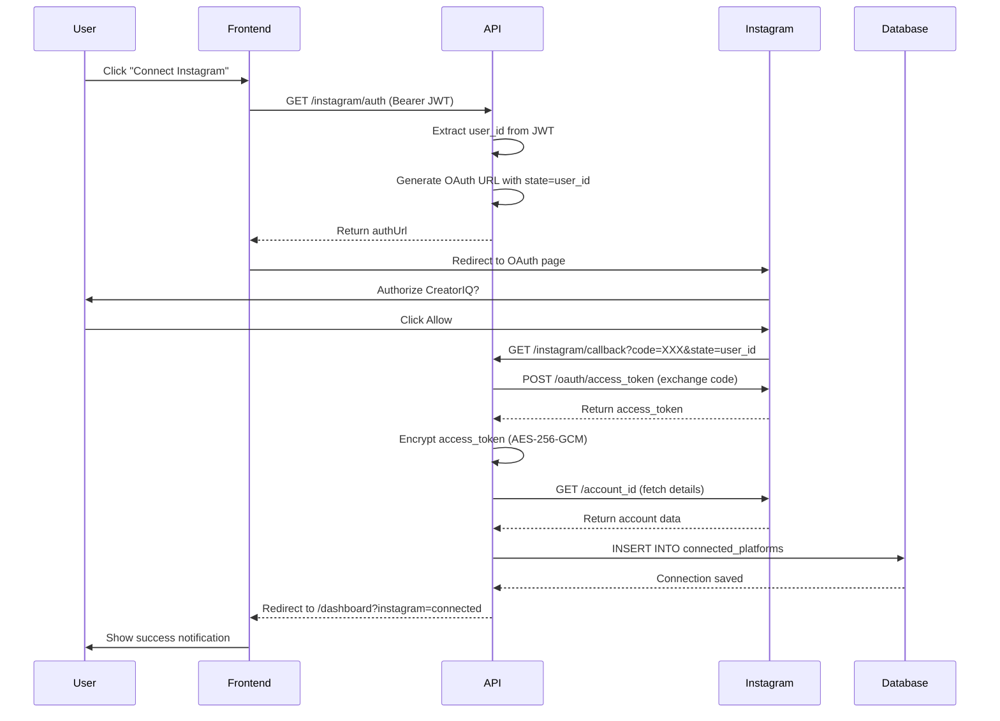

---

## Platform Integrations

### Instagram Graph API Integration

**API Version:** Instagram Graph API **v22.0**

#### Required Permissions

| Permission | Purpose | Access Level |
|------------|---------|--------------|
| `instagram_business_basic` | Read profile info and media | Standard |
| `instagram_business_manage_insights` | Access analytics and demographics | Standard |

#### Demographics API Implementation

The Instagram demographics endpoint requires three separate calls with `metric_type: total_value`:

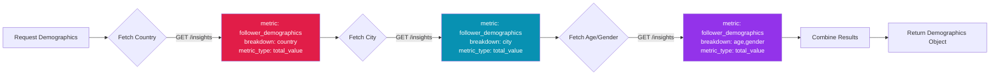

**Code Example:**
```typescript
const countryResponse = await axios.get(
  `${INSTAGRAM_API_BASE}/${igAccountId}/insights`,
  {
    params: {
      metric: 'follower_demographics',
      period: 'lifetime',
      breakdown: 'country',
      metric_type: 'total_value',  // REQUIRED for v22.0
      access_token: accessToken,
    },
  }
);
```

**Deprecated metrics (DO NOT USE):** `audience_city`, `audience_country`, `audience_gender_age`

---

### YouTube API Integration

**API Versions:** YouTube Data API **v3** + YouTube Analytics API **v2**

#### Required Scopes

| Scope | Purpose |
|-------|---------|
| `youtube.readonly` | Read channel data |
| `yt-analytics-monetary.readonly` | Read revenue data |
| `userinfo.profile` | User profile |
| `userinfo.email` | User email |

#### YouTube API Quota Optimization (v3.0)

YouTube API quota is 10,000 units/day per GCP project (shared across all users). Critical optimization replaced `search.list` with `playlistItems.list`:

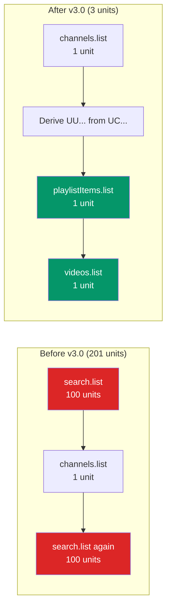

**How it works:**
```typescript
// Derive uploads playlist ID from channel ID
// Channel ID: UC... -> Uploads Playlist: UU...
const uploadsPlaylistId = 'UU' + channelId.substring(2);

const playlistResponse = await youtube.playlistItems.list({
    part: ['snippet'],
    playlistId: uploadsPlaylistId,
    maxResults: maxResults,
});

const videoIds = playlistResponse.data.items
    .map((item) => item.snippet?.resourceId?.videoId)
    .filter(Boolean) as string[];
```

#### Demographics API

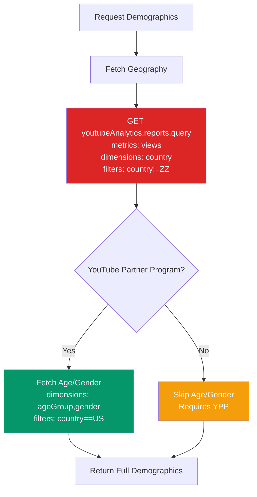

**Important Notes:**
- Geography demographics work for all channels
- Age/gender demographics require YouTube Partner Program enrollment
- `filters` parameter is **required** — `country!=ZZ` excludes unknown, `country==US` required for demographics

---

## Competitor Analysis

### Architecture (v3.0)

The competitor analysis system uses existing platform connections to look up other creators' public profiles.

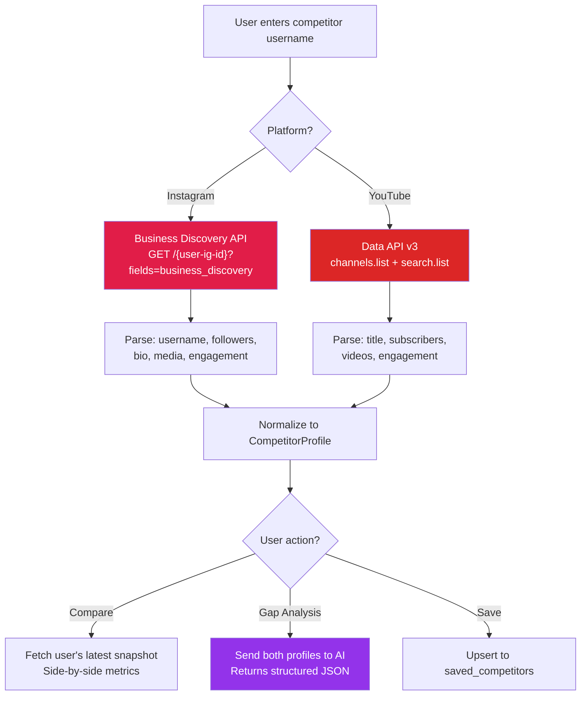

### Instagram Business Discovery API

Uses the **user's own access token** to look up other business/creator accounts:

```typescript
const response = await axios.get(`${INSTAGRAM_API_BASE}/${igUserId}`, {
    params: {
        fields: `business_discovery.fields(username,name,biography,
            followers_count,follows_count,media_count,profile_picture_url,
            media.limit(6){like_count,comments_count,timestamp,media_url,media_type}
        ).username(${competitorUsername})`,
        access_token: accessToken,
    },
});
```

- Requires: `instagram_business_basic` scope (already connected)
- Target must be Business/Creator account (personal accounts will fail gracefully)
- Engagement rate calculated from recent 6 posts: `(avgLikes + avgComments) / followers * 100`

### YouTube Data API Lookup

```typescript
// Try forUsername first, then fallback to search
const channelResponse = await youtube.channels.list({
    part: ['snippet', 'statistics'],
    forUsername: handle,
});

// If not found, search by handle
const searchResponse = await youtube.search.list({
    q: handle,
    type: ['channel'],
    part: ['snippet'],
    maxResults: 1,
});
```

### CompetitorProfile Interface

```typescript
interface CompetitorProfile {
    platform: 'instagram' | 'youtube';
    username: string;
    displayName: string;
    profilePicture: string;
    bio: string;
    followers: number;      // -1 if hidden (YouTube)
    following: number;
    postsCount: number;
    engagementRate: number;
    avgLikes: number;
    avgComments: number;
    postsPerWeek: number;
    recentPosts: Array<{
        likes: number;
        comments: number;
        views: number;
        timestamp: string;
        mediaUrl?: string;
        mediaType?: string;
        title?: string;
    }>;
}
```

---

## AI Services Integration

### Architecture: Primary + Fallback Pattern

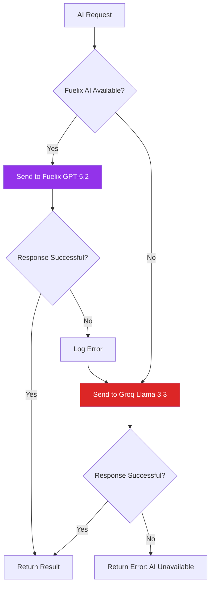

### Fuelix AI Service (Primary)

**Model**: `gpt-5.2-chat-2025-12-11`
**Provider**: Fuelix AI (OpenClaw backend)
**API Base**: `https://api.fuelix.ai/v1`

**Configuration (Lazy Initialization):**
```typescript
class OpenClawService {
  private initialized = false;
  private apiKey = '';
  private baseUrl = '';

  // NEVER read process.env at module load time!
  private ensureInitialized() {
    if (!this.initialized) {
      this.apiKey = process.env.OPENCLAW_API_KEY || '';
      this.baseUrl = process.env.OPENCLAW_API_URL || 'https://api.fuelix.ai/v1';
      this.initialized = true;
    }
  }

  isAvailable(): boolean {
    this.ensureInitialized();
    return !!this.apiKey;
  }
}
```

**Why Lazy Initialization?**
Environment variables are loaded by `dotenv.config()` after module imports. Lazy initialization ensures we read the API key **after** it's been loaded into `process.env`.

### Groq AI Service (Fallback)

**Model**: `llama-3.3-70b-versatile`
**Provider**: Groq
**SDK**: `groq-sdk`

```typescript
const groq = new Groq({ apiKey: process.env.GROQ_API_KEY });
const completion = await groq.chat.completions.create({
  messages: [
    { role: 'system', content: 'You are an expert creator consultant...' },
    { role: 'user', content: prompt }
  ],
  model: 'llama-3.3-70b-versatile',
  temperature: 0.7,
  max_tokens: 1000,
});
```

### AI Feature Matrix

| Feature | Method | Primary | Fallback | Returns |
|---------|--------|---------|----------|---------|
| **Insights** | `generateInsights()` | Fuelix | Groq | Markdown string |
| **Weekly Report** | `generateAnalyticsReport()` | Fuelix | Groq | Structured JSON |
| **Chat** | `chat()` | Fuelix | Groq | Markdown string |
| **Content Ideas** | `generateContentIdeas()` | Fuelix | Groq | Markdown string |
| **Competitor Analysis** | `generateCompetitorAnalysis()` | Fuelix | Groq | Structured JSON |
| **Tax Categorization** | `categorizeTax()` | Fuelix | Groq | JSON |

---

## Security Implementation

### Token Encryption

**Algorithm**: AES-256-GCM
**Key Derivation**: `crypto.scryptSync` with salt

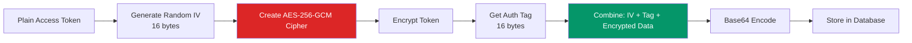

**Encryption Code:**
```typescript
encrypt(plaintext: string): string {
  const iv = crypto.randomBytes(IV_LENGTH); // 16 bytes
  const cipher = crypto.createCipheriv('aes-256-gcm', this.encryptionKey, iv);
  let encrypted = cipher.update(plaintext, 'utf8', 'hex');
  encrypted += cipher.final('hex');
  const tag = cipher.getAuthTag(); // 16 bytes
  const result = Buffer.concat([iv, tag, Buffer.from(encrypted, 'hex')]);
  return result.toString('base64');
}
```

**Decryption Code:**
```typescript
decrypt(encryptedData: string): string {
  const buffer = Buffer.from(encryptedData, 'base64');
  const iv = buffer.subarray(0, IV_LENGTH);
  const tag = buffer.subarray(IV_LENGTH, IV_LENGTH + TAG_LENGTH);
  const encrypted = buffer.subarray(IV_LENGTH + TAG_LENGTH);
  const decipher = crypto.createDecipheriv('aes-256-gcm', this.encryptionKey, iv);
  decipher.setAuthTag(tag);
  let decrypted = decipher.update(encrypted.toString('hex'), 'hex', 'utf8');
  decrypted += decipher.final('utf8');
  return decrypted;
}
```

### Backward Compatibility (safeDecrypt)

For existing plaintext tokens in the database:

```typescript
safeDecrypt(data: string): string {
  try {
    return this.decrypt(data); // Try decryption first
  } catch (error) {
    console.warn('Token decryption failed, using as plaintext (legacy token)');
    return data; // Fallback to plaintext
  }
}
```

### Token Encryption Bug Fix (v3.0)

A critical bug was discovered where encrypted tokens from the database were passed directly to platform APIs without decryption:

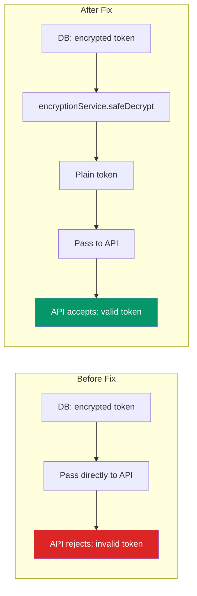

| Location | Issue | Fix |
|----------|-------|-----|
| `analytics-snapshot.job.ts` | `platform.access_token` sent raw | Added `encryptionService.safeDecrypt()` |
| `analytics-snapshot.job.ts` | `platform.refresh_token` sent raw | Added `encryptionService.safeDecrypt()` |
| `/youtube/stats` route | DB token used without decrypt | Added `encryptionService.safeDecrypt()` |
| `saveConnectedPlatform` | `refresh_token` stored unencrypted | Now encrypted with `encryptionService.encrypt()` |

---

## Analytics Snapshot Job

### Overview

The analytics snapshot job runs as a background task, capturing daily metrics for all connected platforms and storing them in `analytics_snapshots` for historical trend analysis.

**Schedule:** Runs on server startup (after 5s delay), then daily at 2:00 AM via interval check.

### Flow

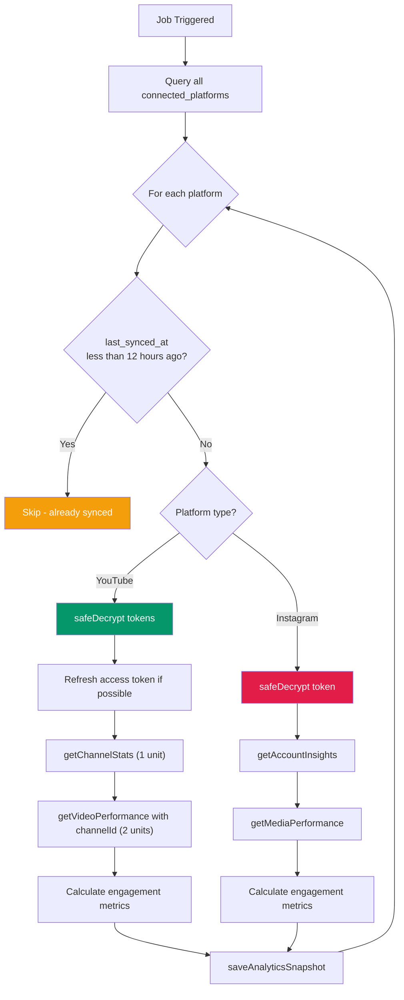

### Optimizations (v3.0)

#### 12-Hour Skip Logic

To conserve API quota, the snapshot job skips platforms that were synced less than 12 hours ago:

```typescript
if (platform.last_synced_at) {
    const hoursSinceSync = (Date.now() - new Date(platform.last_synced_at).getTime()) / (1000 * 60 * 60);
    if (hoursSinceSync < 12) {
        skippedCount++;
        continue;
    }
}
```

#### Channel ID Reuse

The `channelId` from the first `getChannelStats` call is passed to `getVideoPerformance`, avoiding a redundant second API call:

```typescript
const channelStats = await youtubeService.getChannelAnalytics(accessToken);
// Reuse channelId - avoids a second getChannelStats call
const recentVideos = await youtubeService.getVideoPerformance(
    accessToken, channelStats.channelId, 10
);
```

---

## Frontend Architecture

### Dynamic Sidebar (v3.0)

The sidebar component fetches live data to display the authenticated user's identity and platform connection status:

```typescript
// Fetch user from Supabase Auth
const { data: { user } } = await supabase.auth.getUser();

// Check platform connections via DB-only status endpoints (0 API quota)
const ytStatus = await api.get('/youtube/status');
const igStatus = await api.get('/instagram/status');

// Display elements
const fullName = user?.user_metadata?.full_name || user?.email?.split('@')[0] || 'Creator';
const email = user?.email || '';
const initials = fullName.split(' ').map((n: string) => n[0]).join('').toUpperCase().slice(0, 2);
```

**Display elements:**
- User's real name (from `user_metadata.full_name` or email prefix)
- User's email address
- Initials avatar (first letters of name)
- Green/gray connection dots for YouTube and Instagram

### WeeklyReport Component

Consumes the structured JSON from `POST /ai/analytics-report`:

| Field | UI Element |
|-------|-----------|
| `growthScore` | Circular progress indicator (0-100) |
| `statInsights` | Stat cards with trend arrows |
| `platformNudges` | Highlighted tip cards |
| `whatsWorking` | Green checkmark list |
| `needsAttention` | Orange warning list |
| `weeklyAction` | Bold action card |
| `goalText` | Goal progress bar |

### AI Chat UI

- Custom `ReactMarkdown` renderer with components for `h2`, `h3`, `p`, `strong`, `table`, `code`
- Chat history maintained in component state
- Analytics context auto-injected into every message
- System prompt ensures AI never asks for handle or data

### Analytics Page (Two-Step Pattern)

The analytics page uses a two-step connection check to avoid showing "Not Connected" when API quota is exceeded:

1. **Step 1:** Call `/youtube/status` and `/instagram/status` (DB-only, 0 quota) to determine connection state
2. **Step 2:** If connected, call `/youtube/stats` and `/instagram/analytics` (actual API calls) for detailed numbers
3. If Step 2 fails (quota exceeded), still show platform as "Connected" with stats unavailable

---

## Privacy & Compliance

### Privacy Policy (Meta App Review Compliant)

The privacy policy at `creatoriq.in/privacy` has been updated to meet Meta App Review requirements:

| Requirement | Implementation |
|------------|----------------|
| **Instagram-specific data section** | Explains what Instagram data is collected and how it is used |
| **Age restriction** | Users must be 13+ to create an account |
| **Data deletion on disconnect** | Platform data deleted within 24 hours of disconnecting |
| **Contact email** | privacy@creatoriq.in |
| **Data retention** | Analytics snapshots retained while account is active |
| **Third-party sharing** | No user data shared with third parties |
| **Encryption disclosure** | All OAuth tokens encrypted with AES-256-GCM |

### Data Handling Summary

| Data Type | Storage | Retention | Deletion |
|-----------|---------|-----------|----------|
| OAuth tokens | Encrypted (AES-256-GCM) in DB | While connected | Immediate on disconnect |
| Analytics snapshots | Supabase PostgreSQL | While account active | Within 24h of disconnect |
| User profile | Supabase Auth | While account active | On account deletion |
| Chat messages | Not stored server-side | Session only | On page close |
| Saved competitors | Supabase PostgreSQL | While account active | On account deletion |

---

## Deployment Guide

### Production URLs

| Service | URL | Deploy Method |
|---------|-----|---------------|
| **API (Express)** | https://creatoriq-axxp.onrender.com | Auto-deploy from `render.yaml` |
| **Frontend (Next.js)** | https://creatoriq-web.onrender.com | Manual deploy |
| **Domain** | https://creatoriq.in | GoDaddy DNS to Render |
| **Alternate Domain** | https://indiva.co.in | GoDaddy DNS to Render |

### Environment Variables

**Required Variables:**

| Variable | Description | Example |
|----------|-------------|---------|
| `NEXT_PUBLIC_SUPABASE_URL` | Supabase project URL | `https://xxx.supabase.co` |
| `NEXT_PUBLIC_SUPABASE_ANON_KEY` | Supabase anon key | `eyJhbGci...` |
| `SUPABASE_SERVICE_ROLE_KEY` | Supabase service role key | `eyJhbGci...` |
| `GOOGLE_CLIENT_ID` | YouTube OAuth client ID | `123456.apps.googleusercontent.com` |
| `GOOGLE_CLIENT_SECRET` | YouTube OAuth secret | `GOCSPX-xxx` |
| `FACEBOOK_APP_ID` | Instagram app ID | `765342356611450` |
| `FACEBOOK_APP_SECRET` | Instagram app secret | `10c8264ac6...` |
| `OPENCLAW_API_KEY` | Fuelix AI API key | `ak-CDNhG4...` |
| `GROQ_API_KEY` | Groq AI API key | `gsk_FQno...` |
| `ENCRYPTION_KEY` | AES-256 encryption key | `68295ec2f2...` |
| `JWT_SECRET` | JWT signing secret | `development-secret-key` |

### Deployment Architecture

```mermaid
graph TB
    subgraph "DNS"
        DNS[creatoriq.in<br/>GoDaddy]
    end

    subgraph "Frontend - Render"
        A[Next.js App<br/>Static + SSR]
        A --> A1[creatoriq-web.onrender.com]
    end

    subgraph "Backend - Render"
        B[Express API<br/>Node.js Container]
        B --> B1[creatoriq-axxp.onrender.com]
        B --> B2[Auto-deploy via render.yaml]
        B --> B3[Analytics Snapshot Job]
    end

    subgraph "Database - Supabase"
        C[(PostgreSQL)]
        C --> C1[Auto Backups]
        C --> C2[Row-Level Security]
    end

    DNS -->|HTTPS| A
    A1 -->|HTTPS| B1
    B -->|Connection Pool| C

    style A fill:#4F46E5,color:#fff
    style B fill:#059669,color:#fff
    style C fill:#0891B2,color:#fff
    style DNS fill:#F59E0B,color:#fff
```

---

## Development Workflow

### Setup Instructions

```bash
# Clone repository
git clone https://github.com/ritwikvats/creatoriq.git
cd creatoriq

# Install dependencies
npm install

# Setup environment variables
cp .env.example .env
# Edit .env with your credentials

# Start development servers
npm run dev:all  # Starts both frontend and backend

# Or run separately:
cd apps/api && npm run dev      # Backend on :3001
cd apps/web && npm run dev      # Frontend on :3004
```

### Project Structure

```
CreatorIQ/
├── apps/
│   ├── api/                    # Express backend
│   │   ├── src/
│   │   │   ├── routes/         # API route handlers
│   │   │   │   ├── ai.ts              # AI insights, chat, reports
│   │   │   │   ├── competitors.ts     # Competitor analysis
│   │   │   │   ├── instagram.ts       # Instagram OAuth + analytics
│   │   │   │   ├── youtube.ts         # YouTube OAuth + analytics
│   │   │   │   └── ...
│   │   │   ├── services/       # Business logic
│   │   │   │   ├── ai.service.ts          # AI provider orchestration
│   │   │   │   ├── competitor.service.ts  # Competitor lookup + metrics
│   │   │   │   ├── encryption.service.ts  # AES-256-GCM encrypt/decrypt
│   │   │   │   ├── instagram.service.ts   # Instagram Graph API
│   │   │   │   ├── youtube.service.ts     # YouTube Data + Analytics API
│   │   │   │   ├── openclaw.service.ts    # Fuelix AI (GPT-5.2)
│   │   │   │   ├── supabase.service.ts    # Database operations
│   │   │   │   └── ...
│   │   │   ├── middleware/     # Auth, error handling
│   │   │   ├── jobs/           # Background jobs
│   │   │   │   └── analytics-snapshot.job.ts
│   │   │   └── index.ts        # Server entry point
│   │   └── package.json
│   └── web/                    # Next.js frontend
│       ├── app/                # Next.js 14 app router
│       │   ├── dashboard/      # Dashboard pages
│       │   │   ├── analytics/  # Analytics page
│       │   │   ├── audience/   # Demographics page
│       │   │   ├── competitors/ # Competitor analysis (planned)
│       │   │   ├── instagram/  # Instagram detail page
│       │   │   ├── revenue/    # Revenue tracking
│       │   │   ├── settings/   # Settings page
│       │   │   └── tax/        # Tax calculator
│       │   ├── privacy/        # Privacy policy
│       │   ├── terms/          # Terms of service
│       │   └── faq/            # FAQ page
│       ├── components/         # React components
│       │   ├── Sidebar.tsx            # Dynamic sidebar with user info
│       │   ├── DashboardLayout.tsx    # Layout wrapper
│       │   ├── WeeklyReport.tsx       # AI analytics report card
│       │   └── ...
│       ├── lib/                # Utilities
│       │   ├── api-client.ts          # HTTP client for backend
│       │   └── supabase.ts            # Supabase client
│       └── package.json
├── docs/                       # Documentation
├── scripts/                    # Utility scripts
├── render.yaml                # Render deployment config
├── .env.example               # Environment template
├── PRD.md                     # Product requirements
└── TECHNICAL_DOCUMENTATION.md # This file
```

---

## Troubleshooting

### Common Issues

| Issue | Cause | Solution |
|-------|-------|----------|
| "Invalid OAuth access token" | Token expired or invalid | Reconnect platform in dashboard |
| "OPENCLAW_API_KEY not set" | Env var loaded before dotenv | Lazy initialization implemented |
| "Demographics not available" | Missing `metric_type` parameter | Added to all requests |
| "No filter selected" (YouTube) | Analytics API requires filters | Added `filters` parameter |
| "YouTube quota exceeded" | `search.list` costs 100 units/call | Replaced with `playlistItems.list` (1 unit) |
| "Analytics shows Not Connected" | `/youtube/stats` fails on quota | Now uses `/youtube/status` first (DB-only, 0 quota) |
| "Encrypted tokens sent to APIs" | Missing decrypt step in snapshot job | Added `encryptionService.safeDecrypt()` before all API calls |
| "refresh_token stored as plaintext" | `saveConnectedPlatform` didn't encrypt | Now encrypted with `encryptionService.encrypt()` |
| "Competitor lookup 404" | Instagram account is private/personal | Target must be Business/Creator account |
| "AI asks for user handle in chat" | System prompt missing analytics data | Analytics data block injected into system prompt |
| "Sidebar shows hardcoded data" | Previously used static name/email | Now fetches from `supabase.auth.getUser()` |

---

## Changelog

### v3.0 (February 12, 2026)

**YouTube API Quota Optimization**
- Replaced `search.list` (100 units) with `playlistItems.list` (1 unit) in `getRecentVideos` and `getBestPostingTimes`
- Derived uploads playlist ID from channel ID (`UC...` to `UU...`)
- Legacy `getVideoPerformance` export now accepts optional `channelId` to skip redundant calls

**Competitor Analysis (NEW)**
- New `competitor.service.ts` with Instagram Business Discovery API and YouTube Data API v3 lookups
- Routes: `/competitors/lookup`, `/competitors/compare`, `/competitors/gap-analysis`, `/competitors/saved`
- AI-powered gap analysis via `aiService.generateCompetitorAnalysis`

**Analytics Page Architecture**
- Two-step connection check: `/youtube/status` (DB-only) then `/youtube/stats` (API call)
- Platforms show as "Connected" even when stats API quota is exceeded

**Token Encryption Bug Fix**
- Snapshot job and `/youtube/stats` now decrypt tokens via `encryptionService.safeDecrypt()`
- `refresh_token` now encrypted in `saveConnectedPlatform`

**Snapshot Job Optimization**
- 12-hour skip logic: platforms synced less than 12h ago are skipped
- Reuses `channelId` from first `getChannelStats` call

**AI Chat System (NEW)**
- `POST /ai/chat` with analytics context injection
- System prompt with "NEVER ask for handle" rules
- Custom `ReactMarkdown` rendering

**AI Analytics Report (NEW)**
- `POST /ai/analytics-report` returns structured JSON
- Fields: `growthScore`, `statInsights`, `platformNudges`, `whatsWorking`, `needsAttention`, `weeklyAction`, `goalText`
- Consumed by `WeeklyReport` component

**Dynamic Sidebar**
- Fetches user from `supabase.auth.getUser()`
- Fetches platform status from DB-only status endpoints
- Displays real name, email, initials, connection dots

**Privacy & Compliance**
- Privacy policy updated for Meta App Review
- Instagram-specific data section, age restriction (13+), 24h data deletion on disconnect
- Contact: privacy@creatoriq.in

**Deployment**
- API: `creatoriq-axxp.onrender.com` (auto-deploy from `render.yaml`)
- Frontend: `creatoriq-web.onrender.com` (manual deploy)
- Domain: `creatoriq.in`

### v2.0 (February 8, 2026)

- Initial technical documentation
- Core architecture, API endpoints, database schema
- Instagram demographics API v22.0 implementation
- YouTube Analytics API with YPP handling
- AI services (Fuelix + Groq) with fallback pattern
- AES-256-GCM token encryption
- Deployment architecture

---

**Document Maintainer**: Engineering Team
**Last Reviewed**: February 12, 2026
**Next Review**: March 12, 2026
