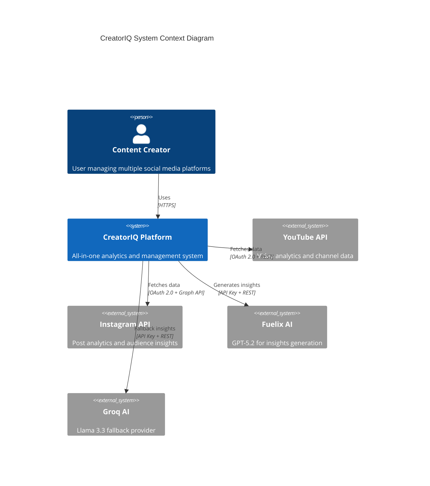
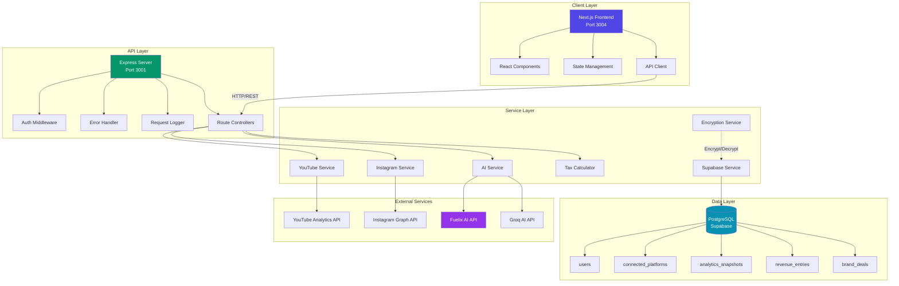
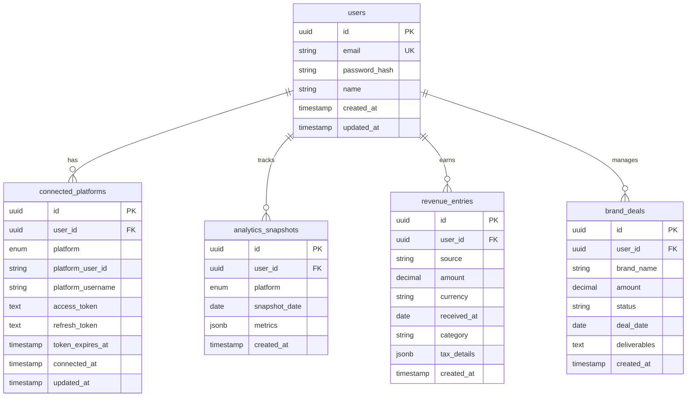
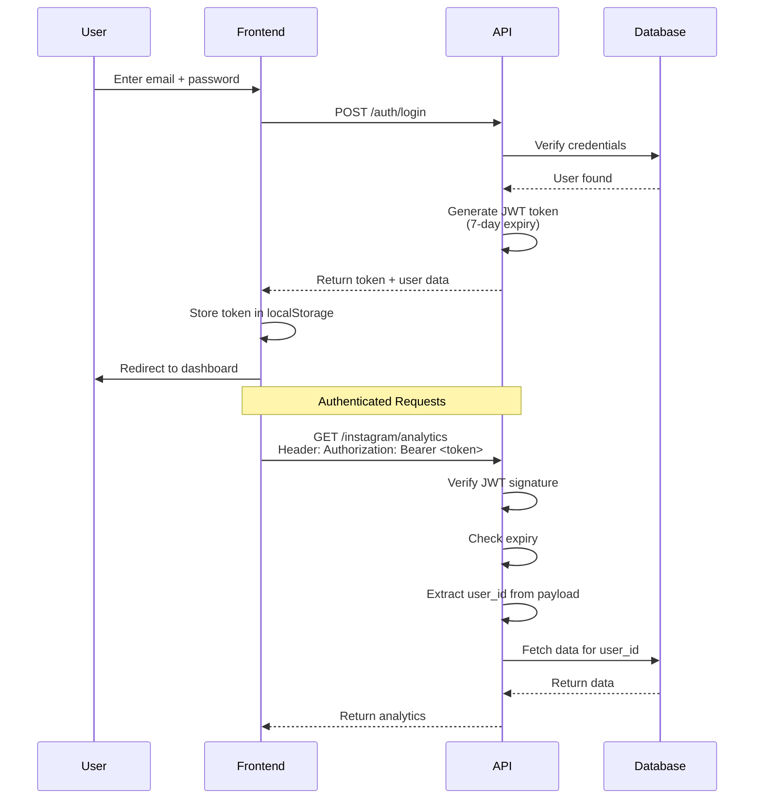
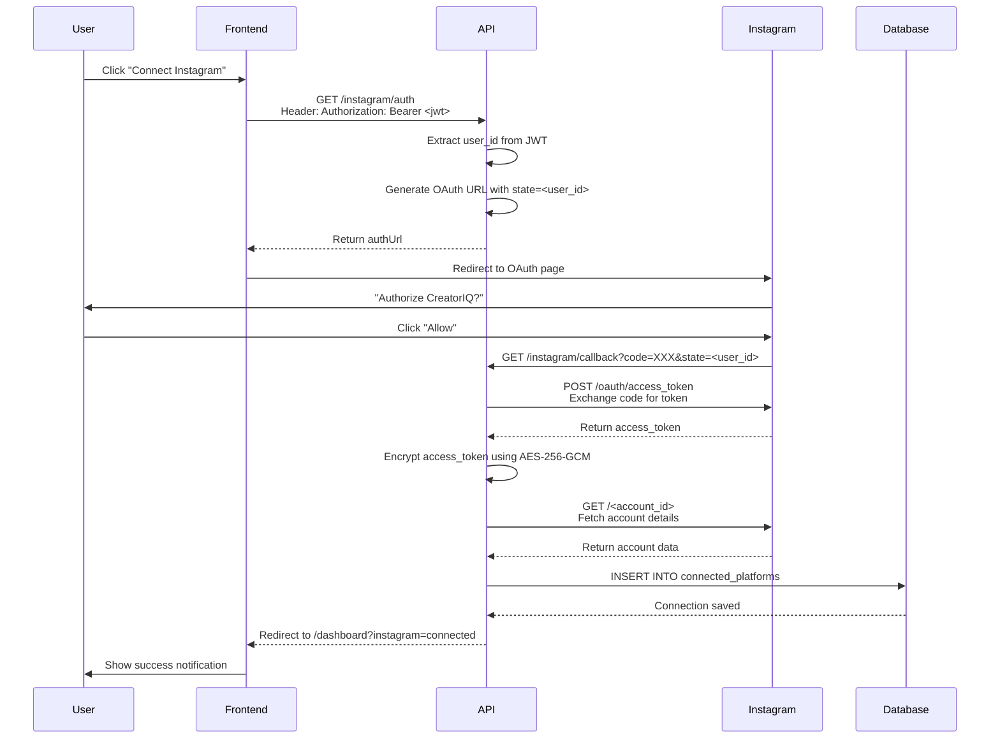
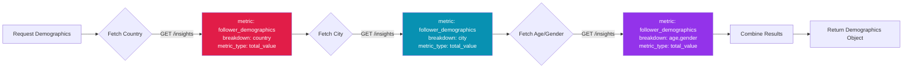
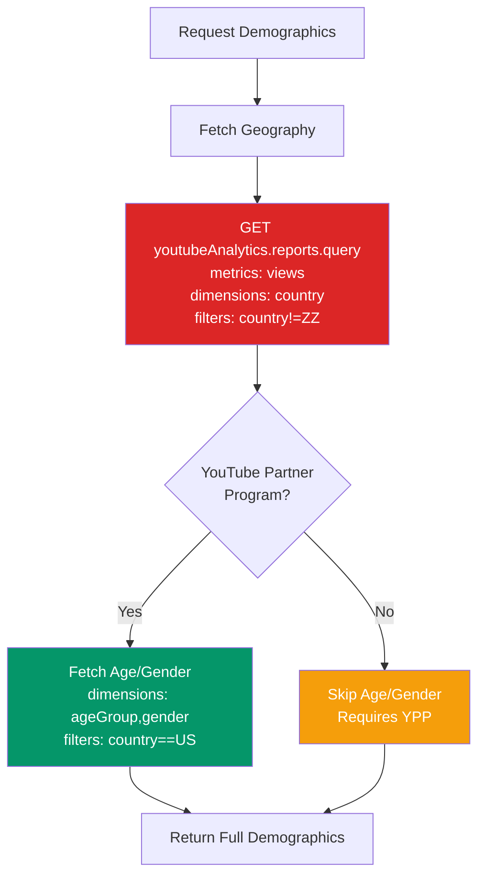
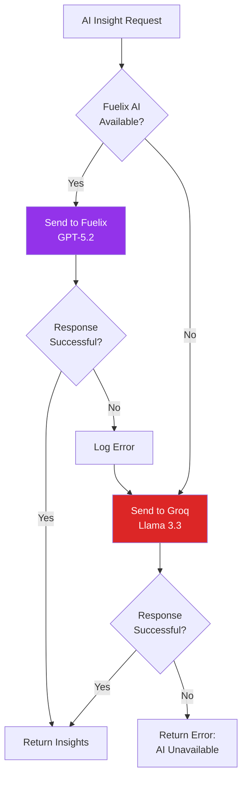
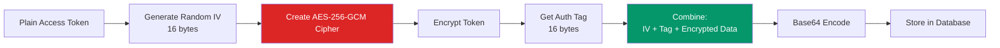
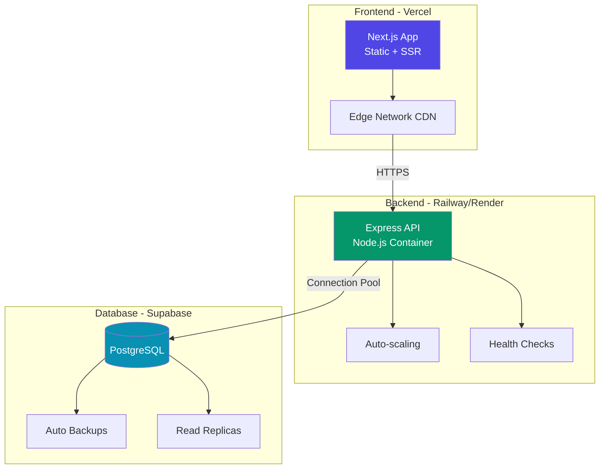

# CreatorIQ - Technical Documentation

> **Version:** 2.0
> **Last Updated:** February 8, 2026
> **Target Audience:** Developers, DevOps Engineers, Technical Contributors

---

## 📚 Table of Contents

1. [System Architecture](#system-architecture)
2. [Technology Stack](#technology-stack)
3. [API Documentation](#api-documentation)
4. [Database Schema](#database-schema)
5. [Authentication Flow](#authentication-flow)
6. [Platform Integrations](#platform-integrations)
7. [AI Services Integration](#ai-services-integration)
8. [Security Implementation](#security-implementation)
9. [Deployment Guide](#deployment-guide)
10. [Development Workflow](#development-workflow)

---

## 🏗️ System Architecture

### High-Level Architecture



### Application Architecture



---

## 🛠️ Technology Stack

### Frontend Stack

| Technology | Version | Purpose |
|------------|---------|---------|
| **Next.js** | 14.2.x | React framework with SSR/SSG |
| **React** | 18.x | UI library |
| **TypeScript** | 5.x | Type-safe JavaScript |
| **TailwindCSS** | 3.x | Utility-first CSS framework |
| **Lucide Icons** | Latest | Modern icon library |
| **Recharts** | 2.x | Data visualization |

### Backend Stack

| Technology | Version | Purpose |
|------------|---------|---------|
| **Node.js** | 20.x LTS | JavaScript runtime |
| **Express** | 4.x | Web server framework |
| **TypeScript** | 5.x | Type-safe backend code |
| **Axios** | 1.x | HTTP client for external APIs |
| **Groq SDK** | Latest | Groq AI integration |
| **Googleapis** | Latest | YouTube API client |

### Database & Storage

| Technology | Purpose |
|------------|---------|
| **Supabase** | PostgreSQL database + Auth |
| **PostgreSQL** | 15.x - Relational database |
| **Row-Level Security** | Data access control |

### AI & ML

| Service | Model | Purpose |
|---------|-------|---------|
| **Fuelix AI** | GPT-5.2 Chat | Primary AI for insights |
| **Groq** | Llama 3.3 70B | Fallback AI provider |

---

## 📡 API Documentation

### Base URLs

| Environment | URL |
|-------------|-----|
| **Development** | http://localhost:3001 |
| **Production** | https://api.creatoriq.app |

### Authentication

All protected endpoints require a JWT token in the Authorization header:

```http
Authorization: Bearer <jwt_token>
```

### API Endpoints Reference

#### Authentication Endpoints

| Method | Endpoint | Description | Auth Required |
|--------|----------|-------------|---------------|
| POST | `/auth/register` | Create new user account | ❌ |
| POST | `/auth/login` | Login and get JWT token | ❌ |
| POST | `/auth/logout` | Logout (invalidate token) | ✅ |
| GET | `/auth/me` | Get current user info | ✅ |

#### Platform Connection Endpoints

| Method | Endpoint | Description | Auth Required |
|--------|----------|-------------|---------------|
| GET | `/instagram/auth` | Get Instagram OAuth URL | ✅ |
| GET | `/instagram/callback` | OAuth callback handler | ❌ |
| GET | `/instagram/status` | Check connection status | ✅ |
| GET | `/instagram/analytics` | Get Instagram analytics | ✅ |
| POST | `/instagram/disconnect` | Disconnect Instagram | ✅ |
| GET | `/youtube/auth` | Get YouTube OAuth URL | ✅ |
| GET | `/youtube/callback` | OAuth callback handler | ❌ |
| GET | `/youtube/status` | Check connection status | ✅ |
| GET | `/youtube/analytics` | Get YouTube analytics | ✅ |
| POST | `/youtube/disconnect` | Disconnect YouTube | ✅ |

#### Analytics Endpoints

| Method | Endpoint | Description | Auth Required |
|--------|----------|-------------|---------------|
| GET | `/analytics/timeline/:userId` | Get analytics timeline | ✅ |
| GET | `/audience/demographics` | Get audience demographics | ✅ |
| GET | `/audience/posting-times` | Get best posting times | ✅ |

#### AI Endpoints

| Method | Endpoint | Description | Auth Required |
|--------|----------|-------------|---------------|
| POST | `/ai/insights` | Generate AI insights | ✅ |
| POST | `/ai/categorize-tax` | Categorize revenue for tax | ✅ |
| POST | `/ai/content-ideas` | Generate content ideas | ✅ |
| GET | `/ai/status` | Check AI service status | ❌ |

---

### API Request/Response Examples

#### POST /ai/insights

**Request:**
```json
{
  "analytics": {
    "instagram": {
      "followers": 209,
      "posts": 39,
      "engagementRate": 4.2,
      "avgLikes": 12,
      "avgComments": 3,
      "username": "ssup.ritwik"
    },
    "youtube": {
      "subscribers": 4,
      "totalViews": 150,
      "totalVideos": 2,
      "channelName": "Ritwik Vats"
    }
  }
}
```

**Response:**
```json
{
  "success": true,
  "insights": "## 📈 Performance Overview\nYour Instagram account (@ssup.ritwik) has 209 followers with an engagement rate of 4.2%...",
  "model": "gpt-5.2-chat-2025-12-11 (Fuelix)"
}
```

#### GET /instagram/analytics

**Response:**
```json
{
  "account": {
    "username": "ssup.ritwik",
    "followers_count": 209,
    "media_count": 39,
    "engagement_rate": 4.2,
    "avg_likes": 12,
    "avg_comments": 3
  },
  "recentMedia": [
    {
      "id": "123456",
      "caption": "Post title...",
      "like_count": 45,
      "comments_count": 8,
      "timestamp": "2026-02-01T10:00:00Z"
    }
  ],
  "topPosts": [
    {
      "id": "123456",
      "like_count": 45,
      "comments_count": 8
    }
  ]
}
```

---

## 🗄️ Database Schema

### Entity Relationship Diagram



### Table Definitions

#### `users` Table

| Column | Type | Constraints | Description |
|--------|------|-------------|-------------|
| `id` | UUID | PRIMARY KEY | Unique user identifier |
| `email` | VARCHAR(255) | UNIQUE, NOT NULL | User email (lowercase) |
| `password_hash` | TEXT | NOT NULL | Bcrypt hashed password |
| `name` | VARCHAR(100) | | User display name |
| `created_at` | TIMESTAMP | DEFAULT NOW() | Account creation time |
| `updated_at` | TIMESTAMP | DEFAULT NOW() | Last update time |

#### `connected_platforms` Table

| Column | Type | Constraints | Description |
|--------|------|-------------|-------------|
| `id` | UUID | PRIMARY KEY | Unique connection ID |
| `user_id` | UUID | FOREIGN KEY | Reference to users table |
| `platform` | ENUM | NOT NULL | 'instagram', 'youtube', etc. |
| `platform_user_id` | VARCHAR(255) | NOT NULL | Instagram account ID or YouTube channel ID |
| `platform_username` | VARCHAR(100) | | Display name (@username) |
| `access_token` | TEXT | ENCRYPTED | OAuth access token (AES-256-GCM) |
| `refresh_token` | TEXT | ENCRYPTED | OAuth refresh token (YouTube only) |
| `token_expires_at` | TIMESTAMP | | Token expiry (YouTube only) |
| `connected_at` | TIMESTAMP | DEFAULT NOW() | When platform was first connected |
| `updated_at` | TIMESTAMP | DEFAULT NOW() | Last token refresh/update |

**Indexes:**
- `UNIQUE(user_id, platform)` - One connection per platform per user
- `INDEX(user_id)` - Fast user lookups

---

## 🔐 Authentication Flow

### JWT Token Authentication



### OAuth 2.0 Flow (Instagram Example)



---

## 🔌 Platform Integrations

### Instagram Graph API Integration

#### API Version
Instagram Graph API **v22.0**

#### Required Permissions

| Permission | Purpose | Access Level |
|------------|---------|--------------|
| `instagram_basic` | Read profile info and media | Standard |
| `instagram_manage_insights` | Access analytics and demographics | Standard |
| `pages_show_list` | List Facebook Pages | Standard |
| `pages_read_engagement` | Read Page engagement data | Standard |

#### Demographics API Implementation

The Instagram demographics endpoint requires specific parameters:



**Code Example:**
```typescript
// Fetch country demographics
const countryResponse = await axios.get(
  `${INSTAGRAM_API_BASE}/${igAccountId}/insights`,
  {
    params: {
      metric: 'follower_demographics',
      period: 'lifetime',
      breakdown: 'country',
      metric_type: 'total_value',
      access_token: accessToken,
    },
  }
);

// Parse response
const countryData = countryResponse.data.data?.[0]?.total_value?.breakdowns?.[0]?.results || [];
const countries = countryData
  .map((item: any) => ({
    country: item.dimension_values?.[0] || 'Unknown',
    count: item.value || 0
  }))
  .sort((a, b) => b.count - a.count)
  .slice(0, 10);
```

---

### YouTube Analytics API Integration

#### API Version
YouTube Data API **v3** + YouTube Analytics API **v2**

#### Required Scopes

| Scope | Purpose |
|-------|---------|
| `https://www.googleapis.com/auth/youtube.readonly` | Read channel data |
| `https://www.googleapis.com/auth/yt-analytics-monetary.readonly` | Read revenue data |
| `https://www.googleapis.com/auth/userinfo.profile` | User profile |
| `https://www.googleapis.com/auth/userinfo.email` | User email |

#### Demographics API



**Important Notes:**
- Geography demographics work for all channels
- Age/gender demographics require YouTube Partner Program enrollment
- Filters are **required** for certain queries to avoid API errors

---

## 🤖 AI Services Integration

### Architecture: Primary + Fallback Pattern



### Fuelix AI Service

**Model**: `gpt-5.2-chat-2025-12-11`
**Provider**: Fuelix AI (OpenClaw backend)
**API Base**: `https://api.fuelix.ai/v1`

**Configuration:**
```typescript
class OpenClawService {
  private apiKey: string;
  private baseUrl: string;

  // Lazy initialization - reads env vars at runtime
  private ensureInitialized() {
    if (!this.initialized) {
      this.apiKey = process.env.OPENCLAW_API_KEY || '';
      this.baseUrl = process.env.OPENCLAW_API_URL || 'https://api.fuelix.ai/v1';
      this.initialized = true;
    }
  }

  isAvailable(): boolean {
    this.ensureInitialized();
    return !!this.apiKey;
  }
}
```

**Why Lazy Initialization?**
Environment variables are loaded by `dotenv.config()` after module imports. Lazy initialization ensures we read the API key **after** it's been loaded into `process.env`.

### Groq AI Service (Fallback)

**Model**: `llama-3.3-70b-versatile`
**Provider**: Groq
**SDK**: `groq-sdk`

**Usage:**
```typescript
const groq = new Groq({ apiKey: process.env.GROQ_API_KEY });
const completion = await groq.chat.completions.create({
  messages: [
    { role: 'system', content: 'You are an expert creator consultant...' },
    { role: 'user', content: prompt }
  ],
  model: 'llama-3.3-70b-versatile',
  temperature: 0.7,
  max_tokens: 1000,
});
```

---

## 🔒 Security Implementation

### Token Encryption

**Algorithm**: AES-256-GCM
**Key Derivation**: `crypto.scryptSync` with salt



**Encryption Code:**
```typescript
encrypt(plaintext: string): string {
  const iv = crypto.randomBytes(IV_LENGTH); // 16 bytes
  const cipher = crypto.createCipheriv('aes-256-gcm', this.encryptionKey, iv);

  let encrypted = cipher.update(plaintext, 'utf8', 'hex');
  encrypted += cipher.final('hex');

  const tag = cipher.getAuthTag(); // 16 bytes

  // Format: iv(16) + tag(16) + encrypted data
  const result = Buffer.concat([iv, tag, Buffer.from(encrypted, 'hex')]);

  return result.toString('base64');
}
```

**Decryption Code:**
```typescript
decrypt(encryptedData: string): string {
  const buffer = Buffer.from(encryptedData, 'base64');

  // Extract components
  const iv = buffer.subarray(0, IV_LENGTH);
  const tag = buffer.subarray(IV_LENGTH, IV_LENGTH + TAG_LENGTH);
  const encrypted = buffer.subarray(IV_LENGTH + TAG_LENGTH);

  const decipher = crypto.createDecipheriv('aes-256-gcm', this.encryptionKey, iv);
  decipher.setAuthTag(tag);

  let decrypted = decipher.update(encrypted.toString('hex'), 'hex', 'utf8');
  decrypted += decipher.final('utf8');

  return decrypted;
}
```

### Backward Compatibility

For existing plaintext tokens in the database:

```typescript
safeDecrypt(data: string): string {
  try {
    return this.decrypt(data); // Try decryption first
  } catch (error) {
    console.warn('⚠️ Token decryption failed, using as plaintext (legacy token)');
    return data; // Fallback to plaintext
  }
}
```

---

## 🚀 Deployment Guide

### Environment Variables

**Required Variables:**

| Variable | Description | Example |
|----------|-------------|---------|
| `NEXT_PUBLIC_SUPABASE_URL` | Supabase project URL | `https://xxx.supabase.co` |
| `NEXT_PUBLIC_SUPABASE_ANON_KEY` | Supabase anon key | `eyJhbGci...` |
| `SUPABASE_SERVICE_ROLE_KEY` | Supabase service role key | `eyJhbGci...` |
| `GOOGLE_CLIENT_ID` | YouTube OAuth client ID | `123456.apps.googleusercontent.com` |
| `GOOGLE_CLIENT_SECRET` | YouTube OAuth secret | `GOCSPX-xxx` |
| `FACEBOOK_APP_ID` | Instagram app ID | `765342356611450` |
| `FACEBOOK_APP_SECRET` | Instagram app secret | `10c8264ac6...` |
| `OPENCLAW_API_KEY` | Fuelix AI API key | `ak-CDNhG4...` |
| `GROQ_API_KEY` | Groq AI API key | `gsk_FQno...` |
| `ENCRYPTION_KEY` | AES-256 encryption key | `68295ec2f2...` |
| `JWT_SECRET` | JWT signing secret | `development-secret-key` |

### Deployment Architecture



---

## 💻 Development Workflow

### Setup Instructions

```bash
# Clone repository
git clone https://github.com/ritwikvats/creatoriq.git
cd creatoriq

# Install dependencies
npm install

# Setup environment variables
cp .env.example .env
# Edit .env with your credentials

# Start development servers
npm run dev:all  # Starts both frontend and backend

# Or run separately:
cd apps/api && npm run dev      # Backend on :3001
cd apps/web && npm run dev      # Frontend on :3004
```

### Project Structure

```
CreatorIQ/
├── apps/
│   ├── api/                    # Express backend
│   │   ├── src/
│   │   │   ├── routes/         # API route handlers
│   │   │   ├── services/       # Business logic
│   │   │   ├── middleware/     # Auth, error handling
│   │   │   ├── jobs/           # Background jobs
│   │   │   └── index.ts        # Server entry point
│   │   └── package.json
│   └── web/                    # Next.js frontend
│       ├── app/                # Next.js 14 app router
│       ├── components/         # React components
│       ├── lib/                # Utilities
│       └── package.json
├── docs/                       # Documentation
├── scripts/                    # Utility scripts
├── .env.example               # Environment template
├── PRD.md                     # Product requirements
└── TECHNICAL_DOCUMENTATION.md # This file
```

---

## 🧪 Testing

### Running Tests

```bash
# Run all tests
npm test

# Run specific test suites
npm test -- --grep "Instagram Service"
npm test -- --grep "AI Insights"

# Coverage report
npm run test:coverage
```

---

## 📊 Monitoring & Logging

### API Logging

All API requests are logged with:
- Method, path, user ID
- Response time
- Status code

Example log:
```
[2026-02-08T07:31:36.049Z] [INFO] [API] GET /demographics { userId: "abc123", duration: "2854ms" }
```

---

## 🆘 Troubleshooting

### Common Issues

| Issue | Cause | Solution |
|-------|-------|----------|
| "Invalid OAuth access token" | Token expired or invalid | Reconnect platform in dashboard |
| "OPENCLAW_API_KEY not set" | Env var loaded before dotenv | Lazy initialization implemented ✅ |
| "Demographics not available" | Missing `metric_type` parameter | Added to all requests ✅ |
| "No filter selected" (YouTube) | Analytics API requires filters | Added `filters` parameter ✅ |

---

**Document Maintainer**: Engineering Team
**Last Reviewed**: February 8, 2026
**Next Review**: March 8, 2026
